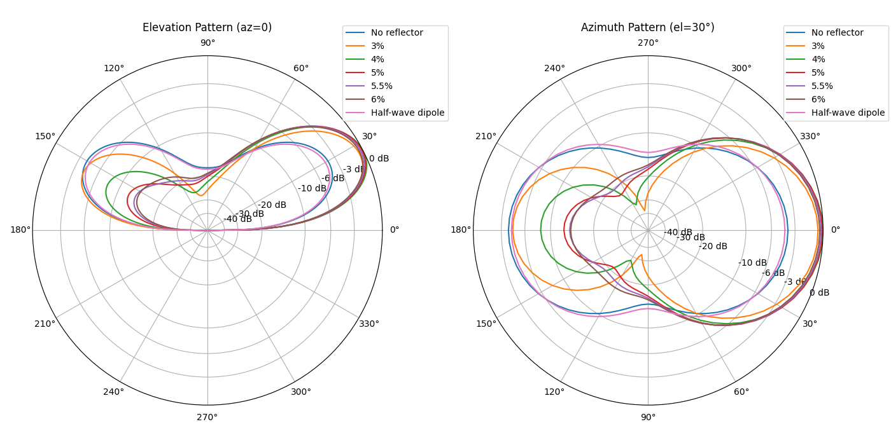
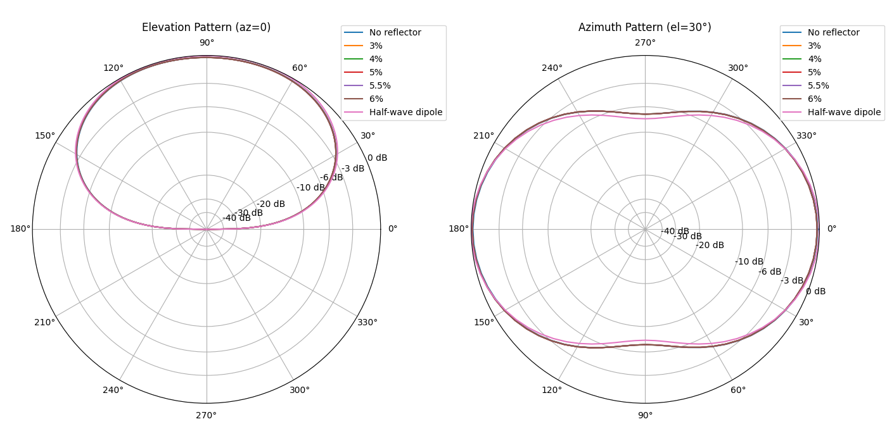
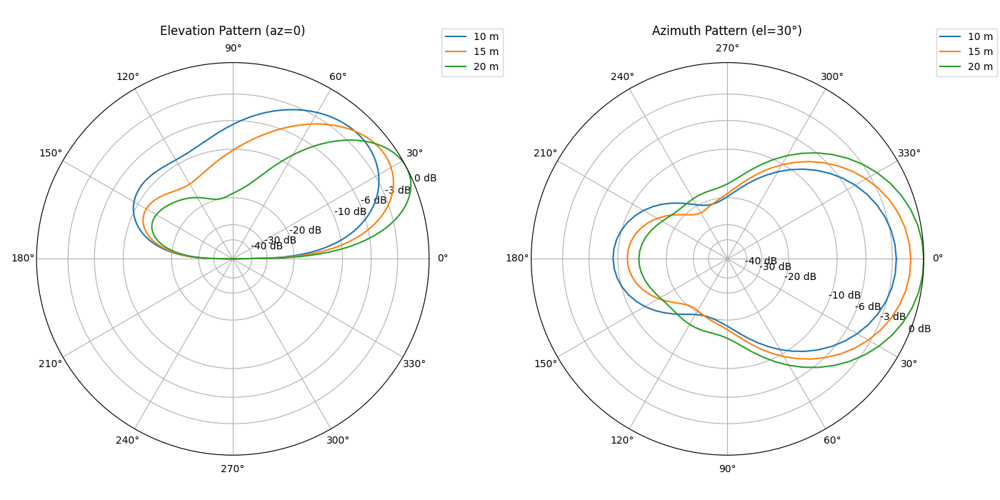
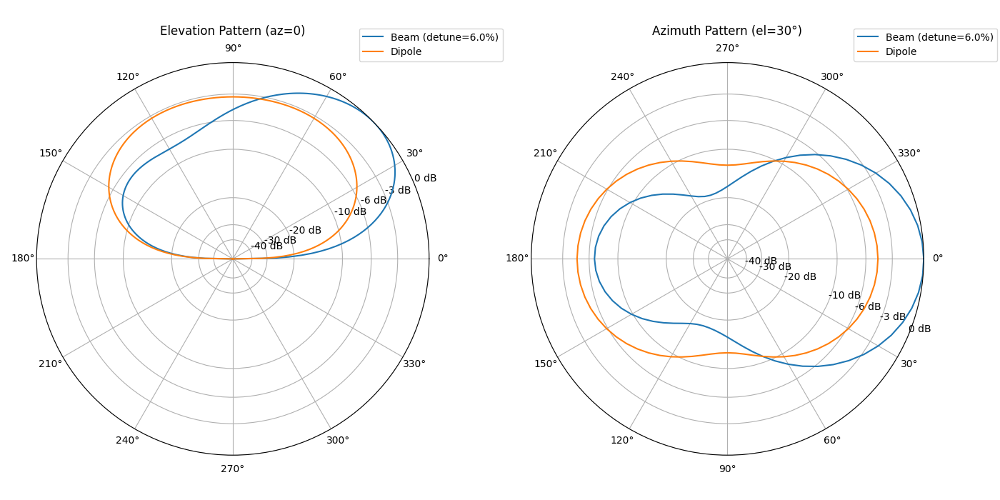
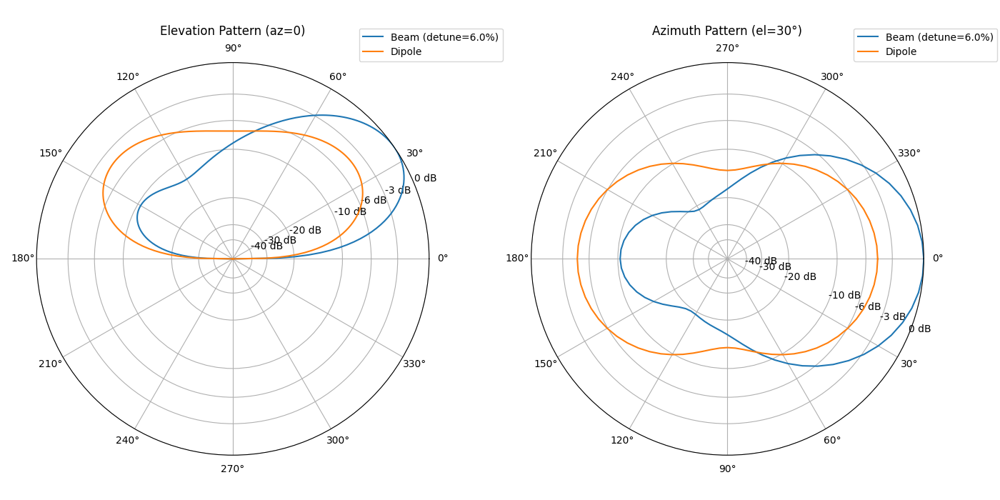
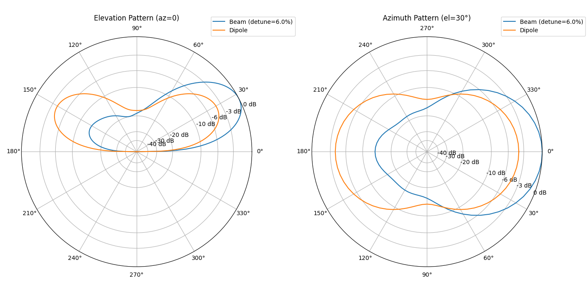
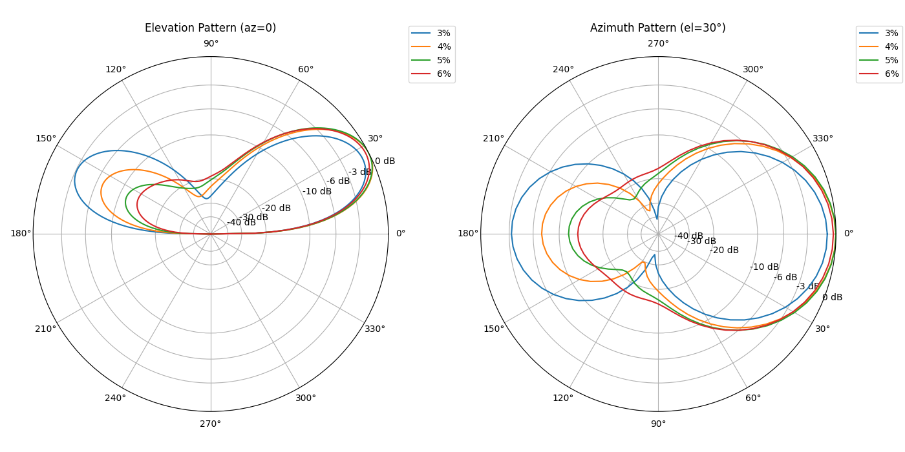
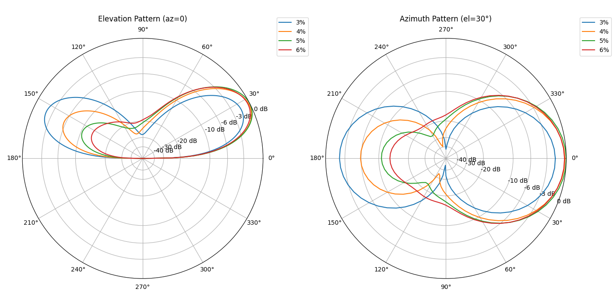

# Report for 2_el_beam_88ft

## Feedpoint Impedance at 7.1 MHz vs Case

Parameters: driven=88'; spacing=20'; height=20.0 m; segments=21; radius=0.001 m; ground=average

| Case | R (Ω) | X (Ω) | Match |
| --- | --- | --- | --- |
| No reflector | 187.66 | 499.55 | C=44.9 pF |
| 3% | 69.87 | 581.49 | C=38.5 pF |
| 4% | 88.31 | 605.32 | C=37.0 pF |
| 5% | 113.14 | 619.09 | C=36.2 pF |
| 6% | 137.81 | 622.50 | C=36.0 pF |

## Feedpoint Impedance at 3.5 MHz vs Case

Parameters: driven=88'; spacing=20'; height=20.0 m; segments=21; radius=0.001 m; ground=average

| Case | R (Ω) | X (Ω) | Match |
| --- | --- | --- | --- |
| No reflector | 24.11 | -654.61 | L=29766.9 nH |
| 3% | 23.53 | -654.73 | L=29772.2 nH |
| 4% | 23.52 | -654.74 | L=29772.7 nH |
| 5% | 23.51 | -654.75 | L=29773.3 nH |
| 6% | 23.50 | -654.76 | L=29773.8 nH |

## Forward Gain and F/B at 7.1 MHz

Parameters: height=20.0 m; el=30.0°; ground=average; segments=21; radius=0.001 m; freq=7.1 MHz

| Case | Fwd Gain (dB) | F/B (dB) |
| --- | --- | --- |
| No reflector | 7.48 | 0.00 |
| 3% | 10.83 | 3.88 |
| 4% | 11.33 | 8.34 |
| 5% | 11.27 | 12.47 |
| 6% | 11.02 | 13.65 |
| Half-wave dipole | 7.11 | 0.00 |

## Forward Gain and F/B at 3.5 MHz

Parameters: height=20.0 m; el=30.0°; ground=average; segments=21; radius=0.001 m; freq=3.5 MHz

| Case | Fwd Gain (dB) | F/B (dB) |
| --- | --- | --- |
| No reflector | 3.91 | 0.00 |
| 3% | 3.86 | -0.11 |
| 4% | 3.86 | -0.11 |
| 5% | 3.86 | -0.11 |
| 6% | 3.86 | -0.12 |
| Half-wave dipole | 4.08 | 0.00 |

## Polar Patterns at 7.1 MHz

Parameters: height=20.0 m; ground=average; segments=21; radius=0.001 m; el=30.0°

## Polar Patterns at 3.5 MHz

Parameters: height=20.0 m; ground=average; segments=21; radius=0.001 m; el=30.0°

## Beam Patterns vs Height at 7.1 MHz

Parameters: heights=[10.0, 15.0, 20.0]; detunes=[0.06, 0.06, 0.06]; spacing=20'; ground=average; segments=21; radius=0.001 m; el=30.0°

## Beam vs Dipole at 10 m (7.1 MHz)

Parameters: frequency=7.1 MHz; height=10.0 m; detune=6.0%; spacing=20'; ground=average; segments=21; radius=0.001 m; el=30.0°

## Beam vs Dipole at 15 m (7.1 MHz)

Parameters: frequency=7.1 MHz; height=15.0 m; detune=6.0%; spacing=20'; ground=average; segments=21; radius=0.001 m; el=30.0°

## Beam vs Dipole at 20 m (7.1 MHz)

Parameters: frequency=7.1 MHz; height=20.0 m; detune=6.0%; spacing=20'; ground=average; segments=21; radius=0.001 m; el=30.0°

## Feedpoint Impedance vs Height Comparison

Parameters: frequency=7.1 MHz; spacing=20'; ground=average; segments=21; radius=0.001 m

| Height (m) | Type | Detune (%) | R (Ω) | X (Ω) | Match |
| --- | --- | --- | --- | --- | --- |
| 10 | Beam | 6.0% | 85.07 | 658.53 | C=34.0 pF |
| 10 | Dipole |  | 76.53 | -8.54 | L=191.5 nH |
| 15 | Beam | 6.0% | 125.11 | 653.93 | C=34.3 pF |
| 15 | Dipole |  | 89.33 | -41.07 | L=920.6 nH |
| 20 | Beam | 6.0% | 137.81 | 622.50 | C=36.0 pF |
| 20 | Dipole |  | 67.78 | -55.73 | L=1249.2 nH |

## Forward Gain & F/B vs Height (7.1 MHz)

Parameters: spacing=20'; ground=average; segments=21; radius=0.001 m; el=30.0°

| Height (m) | Detune (%) | Beam Fwd (dB) | Beam F/B (dB) | No reflector Fwd (dB) | No reflector F/B (dB) |
| --- | --- | --- | --- | --- | --- |
| 10 | 6.0% | 8.43 | 6.68 | 4.13 | 0.00 |
| 15 | 6.0% | 9.84 | 10.36 | 5.55 | 0.00 |
| 20 | 6.0% | 11.02 | 13.65 | 7.48 | 0.00 |

## Feedpoint Impedance vs Detune (spacing=18 ft)

Parameters: frequency=7.1 MHz; height=20.0 m; spacing=18 ft; ground=average; segments=21; radius=0.001 m

| Detune (%) | R (Ω) | X (Ω) |
| --- | --- | --- |
| 3% | 54.14 | 560.48 |
| 4% | 67.98 | 587.66 |
| 5% | 90.07 | 606.20 |
| 6% | 114.09 | 614.46 |

## Detune Sweep Polar Patterns (spacing=18 ft)

Parameters: frequency=7.1 MHz; height=20.0 m; spacing=18 ft; ground=average; segments=21; radius=0.001 m; el=30.0°

## Forward Gain & F/B vs Detune (spacing=18 ft)

Parameters: frequency=7.1 MHz; height=20.0 m; spacing=18 ft; ground=average; segments=21; radius=0.001 m; el=30.0°

| Detune (%) | Fwd Gain (dB) | F/B (dB) |
| --- | --- | --- |
| 3% | 10.46 | 2.39 |
| 4% | 11.30 | 7.19 |
| 5% | 11.32 | 11.71 |
| 6% | 11.06 | 13.30 |

## Feedpoint Impedance vs Detune (spacing=16 ft)

Parameters: frequency=7.1 MHz; height=20.0 m; spacing=16 ft; ground=average; segments=21; radius=0.001 m

| Detune (%) | R (Ω) | X (Ω) |
| --- | --- | --- |
| 3% | 41.42 | 535.83 |
| 4% | 49.94 | 565.54 |
| 5% | 68.28 | 588.41 |
| 6% | 90.62 | 601.55 |

## Detune Sweep Polar Patterns (spacing=16 ft)

Parameters: frequency=7.1 MHz; height=20.0 m; spacing=16 ft; ground=average; segments=21; radius=0.001 m; el=30.0°

## Forward Gain & F/B vs Detune (spacing=16 ft)

Parameters: frequency=7.1 MHz; height=20.0 m; spacing=16 ft; ground=average; segments=21; radius=0.001 m; el=30.0°

| Detune (%) | Fwd Gain (dB) | F/B (dB) |
| --- | --- | --- |
| 3% | 9.72 | 0.46 |
| 4% | 11.18 | 5.70 |
| 5% | 11.36 | 10.69 |
| 6% | 11.11 | 12.86 |
