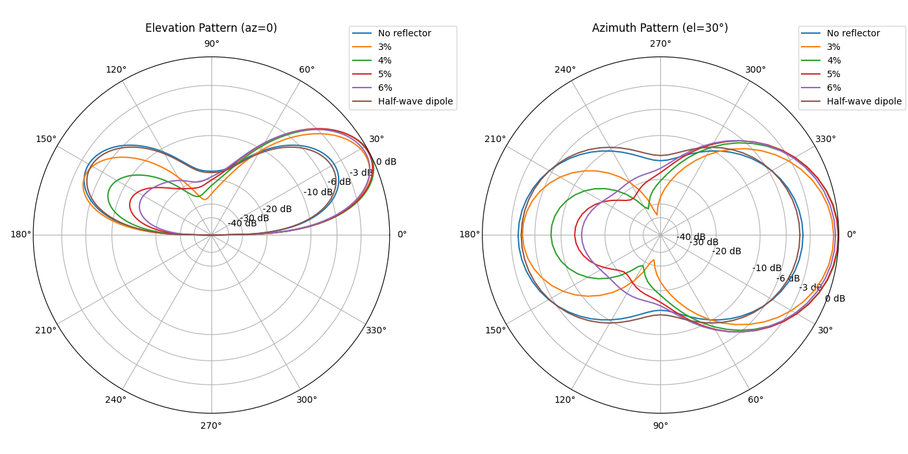
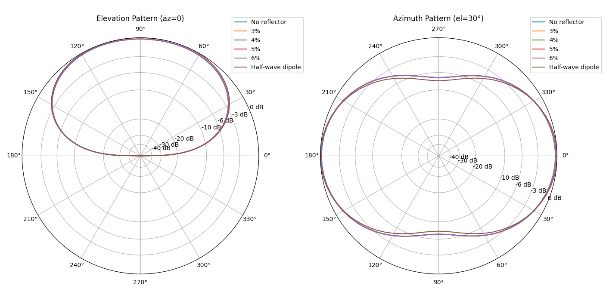

# Report for 2_el_beam_88ft

## Feedpoint Impedance at 7.1 MHz vs Case

Parameters: driven=88'; spacing=20'; height=20.0 m; segments=21; radius=0.001 m; ground=average

| Case | R (Ω) | X (Ω) | Match |
| --- | --- | --- | --- |
| No reflector | 187.66 | 499.55 | C=44.9 pF |
| 3% | 69.87 | 581.49 | C=38.5 pF |
| 4% | 88.31 | 605.32 | C=37.0 pF |
| 5% | 113.14 | 619.09 | C=36.2 pF |
| 5.5% | 125.83 | 621.93 | C=36.0 pF |
| 6% | 137.81 | 622.50 | C=36.0 pF |

## Feedpoint Impedance at 3.5 MHz vs Case

Parameters: driven=88'; spacing=20'; height=20.0 m; segments=21; radius=0.001 m; ground=average

| Case | R (Ω) | X (Ω) | Match |
| --- | --- | --- | --- |
| No reflector | 24.11 | -654.61 | L=29766.9 nH |
| 3% | 23.53 | -654.73 | L=29772.2 nH |
| 4% | 23.52 | -654.74 | L=29772.7 nH |
| 5% | 23.51 | -654.75 | L=29773.3 nH |
| 5.5% | 23.51 | -654.75 | L=29773.5 nH |
| 6% | 23.50 | -654.76 | L=29773.8 nH |

## Forward Gain and Front-to-Back at 7.1 MHz

Parameters: height=20.0 m; el=30.0°; ground=average; segments=21; radius=0.001 m

| Case | Fwd Gain (dB) | F/B (dB) |
| --- | --- | --- |
| No reflector | 7.48 | 0.00 |
| 3% | 10.83 | 3.88 |
| 4% | 11.33 | 8.34 |
| 5% | 11.27 | 12.47 |
| 5.5% | 11.15 | 13.58 |
| 6% | 11.02 | 13.65 |

## Polar Patterns at 7.1 MHz

Parameters: height=20.0 m; ground=average; segments=21; radius=0.001 m; el=30.0°

## Polar Patterns at 3.5 MHz

Parameters: height=20.0 m; ground=average; segments=21; radius=0.001 m; el=30.0°

