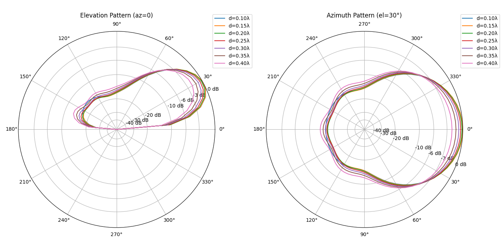

# Report for 2_el_yagi

## Feedpoint Impedance vs Height

| Height (m) | R (Ω) | X (Ω) |
| --- | --- | --- |
| 5.0 | 43.39 | 17.18 |
| 10.0 | 71.28 | -1.19 |
| 15.0 | 50.07 | 0.50 |
| 20.0 | 63.66 | 2.70 |

## Gain at az=0 for Elevation 0–180°

| Elevation (deg) | 5.0 m | 10.0 m | 15.0 m | 20.0 m |
| --- | --- | --- | --- | --- |
| 0 | -999.000 | -297.322 | -298.399 | -298.318 |
| 5 | -4.957 | 0.296 | 3.657 | 5.890 |
| 10 | 0.715 | 5.754 | 8.738 | 10.426 |
| 15 | 3.790 | 8.473 | 10.801 | 11.475 |
| 20 | 5.748 | 9.931 | 11.276 | 10.218 |
| 25 | 7.056 | 10.593 | 10.532 | 6.285 |
| 30 | 7.922 | 10.665 | 8.594 | -3.316 |
| 35 | 8.463 | 10.260 | 5.177 | 0.321 |
| 40 | 8.747 | 9.447 | -0.492 | 6.320 |
| 45 | 8.824 | 8.273 | -4.844 | 8.575 |
| 50 | 8.726 | 6.778 | 0.298 | 9.129 |
| 55 | 8.480 | 5.006 | 3.672 | 8.628 |
| 60 | 8.107 | 3.018 | 5.403 | 7.375 |
| 65 | 7.622 | 0.918 | 6.212 | 5.572 |
| 70 | 7.038 | -1.141 | 6.451 | 3.405 |
| 75 | 6.367 | -2.979 | 6.320 | 1.098 |
| 80 | 5.619 | -4.484 | 5.941 | -1.073 |
| 85 | 4.803 | -5.679 | 5.396 | -2.842 |
| 90 | 3.935 | -6.667 | 4.736 | -4.061 |
| 95 | 3.039 | -7.513 | 3.983 | -4.699 |
| 100 | 2.156 | -8.183 | 3.141 | -4.805 |
| 105 | 1.349 | -8.602 | 2.191 | -4.540 |
| 110 | 0.707 | -8.779 | 1.091 | -4.166 |
| 115 | 0.313 | -8.853 | -0.234 | -3.929 |
| 120 | 0.206 | -9.009 | -1.931 | -3.957 |
| 125 | 0.343 | -9.331 | -4.319 | -4.244 |
| 130 | 0.618 | -9.656 | -8.109 | -4.739 |
| 135 | 0.908 | -9.492 | -13.452 | -5.609 |
| 140 | 1.102 | -8.460 | -9.134 | -7.624 |
| 145 | 1.109 | -6.918 | -3.388 | -13.092 |
| 150 | 0.848 | -5.512 | 0.166 | -16.120 |
| 155 | 0.230 | -4.644 | 2.265 | -5.948 |
| 160 | -0.869 | -4.532 | 3.165 | -1.531 |
| 165 | -2.663 | -5.403 | 2.825 | 0.104 |
| 170 | -5.621 | -7.715 | 0.864 | -0.676 |
| 175 | -11.221 | -12.933 | -4.153 | -5.051 |
| 180 | -999.000 | -999.000 | -999.000 | -999.000 |

## Azimuth Pattern (el=30°)

## Forward Gain vs Detune (%) and Spacing

| Detune (%) | 0.10λ | 0.15λ | 0.20λ | 0.25λ | 0.30λ | 0.35λ | 0.40λ |
| --- | --- | --- | --- | --- | --- | --- | --- |
| 0.00 | 0.52 | 6.86 | 9.16 | 9.90 | 10.07 | 9.95 | 9.63 |
| 1.00 | 3.65 | 8.78 | 10.07 | 10.37 | 10.33 | 10.09 | 9.69 |
| 2.00 | 7.92 | 10.24 | 10.66 | 10.64 | 10.45 | 10.13 | 9.64 |
| 3.00 | 10.46 | 10.92 | 10.89 | 10.71 | 10.44 | 10.04 | 9.49 |
| 4.00 | 11.11 | 11.01 | 10.85 | 10.62 | 10.30 | 9.86 | 9.23 |
| 5.00 | 10.93 | 10.83 | 10.66 | 10.43 | 10.09 | 9.61 | 8.91 |
| 6.00 | 10.56 | 10.56 | 10.43 | 10.20 | 9.85 | 9.33 | 8.56 |
| 7.00 | 10.20 | 10.28 | 10.19 | 9.96 | 9.60 | 9.05 | 8.22 |
| 8.00 | 9.89 | 10.03 | 9.96 | 9.74 | 9.36 | 8.78 | 7.90 |
| 9.00 | 9.63 | 9.80 | 9.75 | 9.54 | 9.15 | 8.54 | 7.62 |
| 10.00 | 9.42 | 9.61 | 9.57 | 9.36 | 8.95 | 8.32 | 7.38 |

## Front-to-Back Ratio vs Detune (%) and Spacing

| Detune (%) | 0.10λ | 0.15λ | 0.20λ | 0.25λ | 0.30λ | 0.35λ | 0.40λ |
| --- | --- | --- | --- | --- | --- | --- | --- |
| 0.00 | -10.11 | -3.16 | 0.61 | 2.74 | 3.92 | 4.42 | 4.39 |
| 1.00 | -7.15 | -0.41 | 2.80 | 4.56 | 5.46 | 5.73 | 5.46 |
| 2.00 | -2.06 | 3.01 | 5.51 | 6.83 | 7.38 | 7.35 | 6.80 |
| 3.00 | 3.54 | 7.04 | 8.77 | 9.56 | 9.69 | 9.29 | 8.38 |
| 4.00 | 9.90 | 11.80 | 12.58 | 12.69 | 12.28 | 11.41 | 10.08 |
| 5.00 | 16.83 | 16.57 | 16.18 | 15.50 | 14.52 | 13.17 | 11.42 |
| 6.00 | 15.96 | 16.81 | 16.73 | 16.12 | 15.08 | 13.62 | 11.70 |
| 7.00 | 12.29 | 13.99 | 14.63 | 14.55 | 13.86 | 12.62 | 10.81 |
| 8.00 | 9.95 | 11.68 | 12.50 | 12.64 | 12.16 | 11.11 | 9.43 |
| 9.00 | 8.42 | 10.04 | 10.86 | 11.04 | 10.64 | 9.67 | 8.08 |
| 10.00 | 7.35 | 8.85 | 9.61 | 9.78 | 9.39 | 8.45 | 6.92 |

## Polar Patterns (Azimuth & Elevation)

## Spacing-Sweep Polar Patterns

