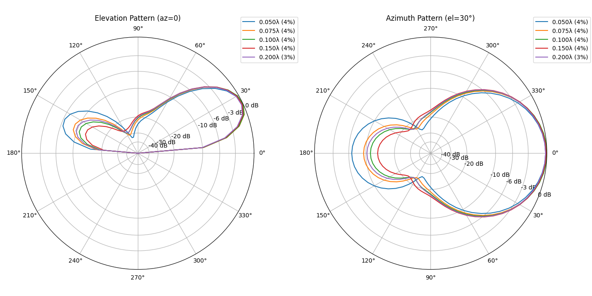
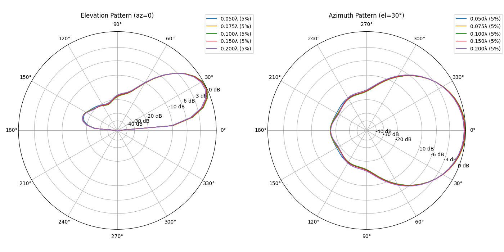
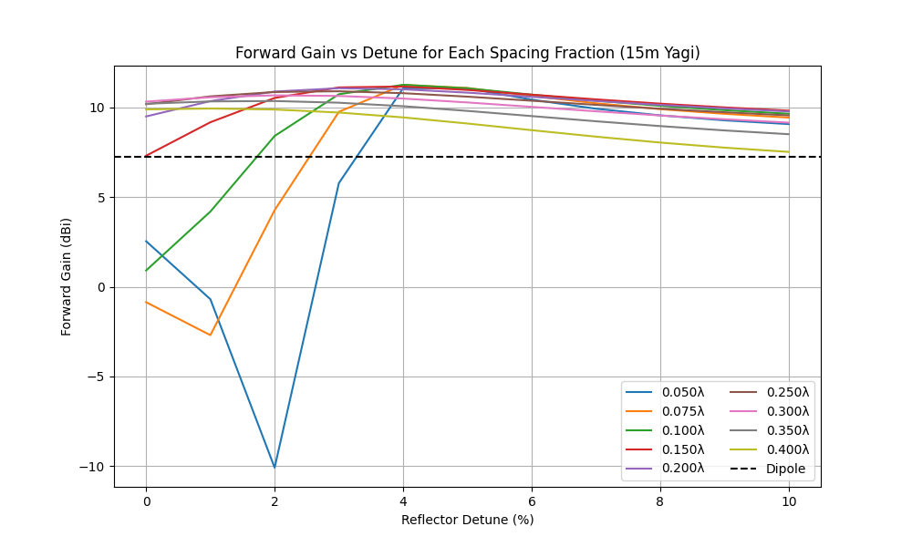
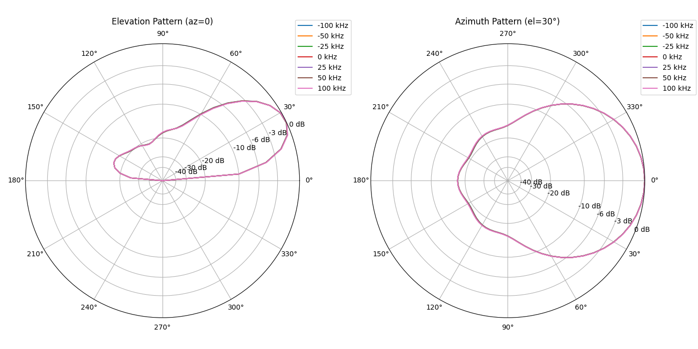

# Report for 2_el_yagi_15m

## Best Gain and F/B vs Boom Length

Parameters: frequency = 21.0 MHz; height = 7.14 m (~0.5λ); ground = average; segments = 21; radius = 0.001 m; elevation = 30° (azimuth pattern)

| Boom (ft, λ) | Max Gain (dBi) | Detune for Max Gain (%) | Max F/B (dB) | Detune for Max F/B (%) |
| --- | --- | --- | --- | --- |
| 2.0 (0.043λ) | 11.30 | 4.50 | 17.28 | 5.00 |
| 3.0 (0.064λ) | 11.27 | 4.50 | 17.13 | 5.00 |
| 4.0 (0.085λ) | 11.27 | 4.00 | 17.09 | 5.00 |
| 5.0 (0.107λ) | 11.26 | 4.00 | 17.13 | 5.00 |
| 6.0 (0.128λ) | 11.22 | 4.00 | 17.18 | 5.00 |
| 7.0 (0.149λ) | 11.19 | 3.50 | 17.22 | 5.00 |
| 8.0 (0.171λ) | 11.15 | 3.50 | 17.22 | 5.00 |
| 9.0 (0.192λ) | 11.09 | 3.00 | 17.16 | 5.00 |
| 10.0 (0.214λ) | 11.04 | 3.00 | 17.05 | 5.00 |

## Forward Gain vs Detune (%) and Spacing

Parameters: frequency = 21.0 MHz; detune steps = 0%–10% in 1% increments; spacing fractions = [0.05, 0.075, 0.1, 0.15, 0.2, 0.25, 0.3, 0.35, 0.4] λ; ground = average; segments = 21; radius = 0.001 m; height = 7.1 m (~0.5λ); elevation = 30°

| Detune (%) | Reflector Length (λ) | 0.05λ (2.3 ft) | 0.07λ (3.5 ft) | 0.10λ (4.7 ft) | 0.15λ (7.0 ft) | 0.20λ (9.4 ft) | 0.25λ (11.7 ft) | 0.30λ (14.1 ft) | 0.35λ (16.4 ft) | 0.40λ (18.7 ft) |
| --- | --- | --- | --- | --- | --- | --- | --- | --- | --- | --- |
| 0.00 | 0.500 | 2.54 | -0.86 | 0.91 | 7.31 | 9.50 | 10.18 | 10.33 | 10.21 | 9.89 |
| 1.00 | 0.505 | -0.70 | -2.70 | 4.19 | 9.18 | 10.36 | 10.62 | 10.57 | 10.34 | **9.94** |
| 2.00 | 0.510 | -10.09 | 4.27 | 8.41 | 10.53 | 10.89 | 10.86 | **10.68** | **10.36** | 9.89 |
| 3.00 | 0.515 | 5.78 | 9.76 | 10.74 | 11.12 | **11.07** | **10.91** | 10.64 | 10.27 | 9.72 |
| 4.00 | 0.520 | **11.08** | **11.26** | **11.27** | **11.17** | 11.01 | 10.80 | 10.50 | 10.07 | 9.45 |
| 5.00 | 0.525 | 11.07 | 11.09 | 11.07 | 10.98 | 10.83 | 10.60 | 10.28 | 9.81 | 9.11 |
| 6.00 | 0.530 | 10.44 | 10.64 | 10.72 | 10.71 | 10.60 | 10.38 | 10.04 | 9.52 | 8.74 |
| 7.00 | 0.535 | 9.93 | 10.24 | 10.38 | 10.45 | 10.36 | 10.15 | 9.79 | 9.23 | 8.37 |
| 8.00 | 0.540 | 9.56 | 9.91 | 10.09 | 10.21 | 10.15 | 9.93 | 9.55 | 8.96 | 8.04 |
| 9.00 | 0.545 | 9.28 | 9.65 | 9.85 | 10.01 | 9.95 | 9.73 | 9.34 | 8.72 | 7.76 |
| 10.00 | 0.550 | 9.07 | 9.44 | 9.65 | 9.82 | 9.78 | 9.56 | 9.16 | 8.51 | 7.52 |

## Front-to-Back Ratio vs Detune (%) and Spacing

Parameters: frequency = 21.0 MHz; detune steps = 0%–10% in 1% increments; spacing fractions = [0.05, 0.075, 0.1, 0.15, 0.2, 0.25, 0.3, 0.35, 0.4] λ; ground = average; segments = 21; radius = 0.001 m; height = 7.1 m (~0.5λ); elevation = 30°

| Detune (%) | Reflector Length (λ) | 0.05λ (2.3 ft) | 0.07λ (3.5 ft) | 0.10λ (4.7 ft) | 0.15λ (7.0 ft) | 0.20λ (9.4 ft) | 0.25λ (11.7 ft) | 0.30λ (14.1 ft) | 0.35λ (16.4 ft) | 0.40λ (18.7 ft) |
| --- | --- | --- | --- | --- | --- | --- | --- | --- | --- | --- |
| 0.00 | 0.500 | -7.20 | -11.39 | -9.93 | -2.69 | 1.19 | 3.38 | 4.58 | 5.08 | 4.99 |
| 1.00 | 0.505 | -11.06 | -13.75 | -6.71 | 0.22 | 3.55 | 5.38 | 6.31 | 6.56 | 6.23 |
| 2.00 | 0.510 | -21.22 | -6.78 | -1.38 | 3.86 | 6.50 | 7.90 | 8.48 | 8.43 | 7.81 |
| 3.00 | 0.515 | -5.13 | 1.16 | 4.50 | 8.22 | 10.11 | 10.99 | 11.15 | 10.71 | 9.71 |
| 4.00 | 0.520 | 6.45 | 9.42 | 11.26 | 13.36 | 14.28 | 14.47 | 14.07 | 13.15 | 11.69 |
| 5.00 | 0.525 | **17.24** | **17.10** | **17.11** | **17.22** | **17.13** | **16.70** | **15.87** | **14.59** | **12.79** |
| 6.00 | 0.530 | 11.34 | 13.28 | 14.38 | 15.47 | 15.82 | 15.67 | 15.02 | 13.86 | 12.09 |
| 7.00 | 0.535 | 8.05 | 9.91 | 11.17 | 12.66 | 13.33 | 13.42 | 12.98 | 11.98 | 10.35 |
| 8.00 | 0.540 | 6.32 | 7.97 | 9.15 | 10.63 | 11.35 | 11.49 | 11.10 | 10.16 | 8.58 |
| 9.00 | 0.545 | 5.25 | 6.72 | 7.80 | 9.19 | 9.87 | 10.00 | 9.60 | 8.67 | 7.11 |
| 10.00 | 0.550 | 4.53 | 5.85 | 6.84 | 8.14 | 8.76 | 8.85 | 8.43 | 7.48 | 5.93 |

## Half-wave Dipole Reference

Parameters: frequency = 21.0 MHz; height = 7.14 m (~0.5λ); ground = average; segments = 21; radius = 0.001 m; elevation = 30°

| Gain (dBi) | F/B (dB) |
| --- | --- |
| 7.25 | 0.00 |

## Polar Patterns (Max Gain per Spacing)

Parameters: frequency = 21.0 MHz; height = 7.1 m (~0.5λ); ground = average; segments = 21; radius = 0.001 m; elevation cut = 30°; dipole dashed

## Polar Patterns (Max F/B per Spacing)

Parameters: frequency = 21.0 MHz; height = 7.1 m (~0.5λ); ground = average; segments = 21; radius = 0.001 m; elevation cut = 30°; dipole dashed

## Forward Gain vs Detune for Each Spacing Fraction

Parameters: frequency = 21.0 MHz; height = 7.14 m (~0.5λ); ground = average; segments = 21; radius = 0.001 m; elevation = 30° (azimuth pattern)

## Front-to-Back Ratio vs Detune for Each Spacing Fraction

Parameters: frequency = 21.0 MHz; height = 7.14 m (~0.5λ); ground = average; segments = 21; radius = 0.001 m; elevation = 30° (azimuth pattern)

## Criticality Polar Patterns (0.050λ)

Parameters: frequency offsets = ±25, ±50, ±100 kHz; reflector detune optimized for max F/B; spacing = 0.050λ

## Criticality Data (0.050λ)

Parameters: spacing = 0.050λ; detune = 5.00%

| Offset (kHz) | Forward Gain (dBi) | F/B (dB) |
| --- | --- | --- |
| -100 | 11.06 | 17.36 |
| -50 | 11.06 | 17.30 |
| -25 | 11.07 | 17.27 |
| 0 | 11.07 | 17.24 |
| 25 | 11.07 | 17.21 |
| 50 | 11.08 | 17.18 |
| 100 | 11.08 | 17.11 |

## Criticality Polar Patterns (0.075λ)

Parameters: frequency offsets = ±25, ±50, ±100 kHz; reflector detune optimized for max F/B; spacing = 0.075λ

## Criticality Data (0.075λ)

Parameters: spacing = 0.075λ; detune = 5.00%

| Offset (kHz) | Forward Gain (dBi) | F/B (dB) |
| --- | --- | --- |
| -100 | 11.08 | 17.17 |
| -50 | 11.08 | 17.13 |
| -25 | 11.09 | 17.11 |
| 0 | 11.09 | 17.10 |
| 25 | 11.09 | 17.07 |
| 50 | 11.09 | 17.05 |
| 100 | 11.10 | 17.01 |

## Criticality Polar Patterns (0.100λ)

Parameters: frequency offsets = ±25, ±50, ±100 kHz; reflector detune optimized for max F/B; spacing = 0.100λ

## Criticality Data (0.100λ)

Parameters: spacing = 0.100λ; detune = 5.00%

| Offset (kHz) | Forward Gain (dBi) | F/B (dB) |
| --- | --- | --- |
| -100 | 11.06 | 17.17 |
| -50 | 11.06 | 17.14 |
| -25 | 11.07 | 17.13 |
| 0 | 11.07 | 17.11 |
| 25 | 11.07 | 17.10 |
| 50 | 11.07 | 17.08 |
| 100 | 11.08 | 17.05 |

## Criticality Polar Patterns (0.150λ)

Parameters: frequency offsets = ±25, ±50, ±100 kHz; reflector detune optimized for max F/B; spacing = 0.150λ

## Criticality Data (0.150λ)

Parameters: spacing = 0.150λ; detune = 5.00%

| Offset (kHz) | Forward Gain (dBi) | F/B (dB) |
| --- | --- | --- |
| -100 | 10.97 | 17.24 |
| -50 | 10.97 | 17.23 |
| -25 | 10.98 | 17.23 |
| 0 | 10.98 | 17.22 |
| 25 | 10.98 | 17.21 |
| 50 | 10.98 | 17.20 |
| 100 | 10.99 | 17.18 |
