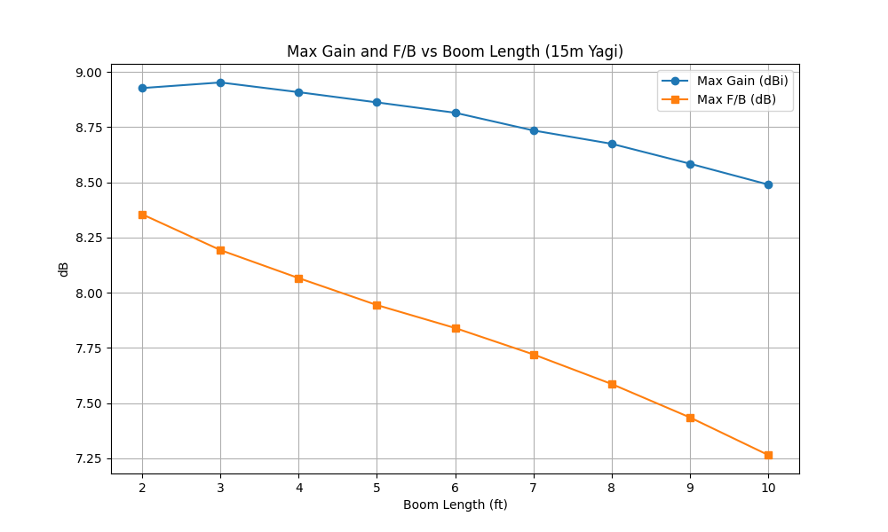
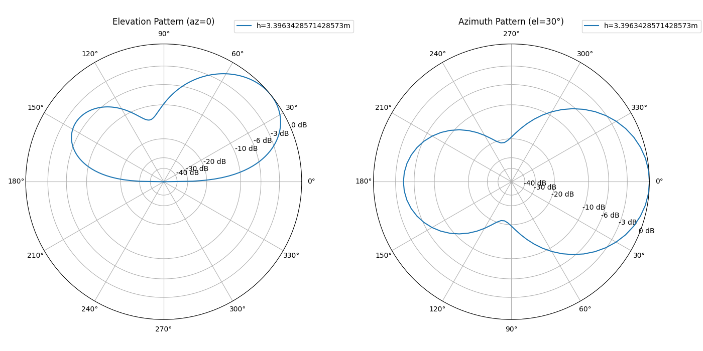

# Report for 2_el_yagi_15m

## Best Gain and F/B vs Boom Length

Parameters: frequency = 21.0 MHz; height = 3.40 m (~0.5λ); ground = average; segments = 21; radius = 0.001 m; elevation = 30° (azimuth pattern)

| Boom (ft, λ) | Max Gain (dBi) | Detune for Max Gain (%) | Max F/B (dB) | Detune for Max F/B (%) |
| --- | --- | --- | --- | --- |
| 2.0 (0.043λ) | 8.93 | 4.00 | 8.36 | 5.50 |
| 3.0 (0.064λ) | 8.95 | 4.00 | 8.19 | 6.00 |
| 4.0 (0.085λ) | 8.91 | 3.50 | 8.07 | 6.00 |
| 5.0 (0.107λ) | 8.86 | 3.50 | 7.94 | 6.50 |
| 6.0 (0.128λ) | 8.82 | 3.00 | 7.84 | 6.50 |
| 7.0 (0.149λ) | 8.74 | 3.00 | 7.72 | 6.50 |
| 8.0 (0.171λ) | 8.67 | 2.50 | 7.59 | 6.50 |
| 9.0 (0.192λ) | 8.58 | 2.00 | 7.44 | 6.50 |
| 10.0 (0.214λ) | 8.49 | 2.00 | 7.27 | 6.00 |

## Detail: Gain and F/B vs Detune for Boom 2.0 ft (0.043λ)

Parameters: Boom = 2.0 ft (0.043λ); frequency = 21.0 MHz; height = 3.40 m; ground = average; segments = 21; radius = 0.001 m; elevation = 30° (azimuth pattern)

| Detune (%) | Fwd Gain (dBi) | F/B (dB) |
| --- | --- | --- |
| 0 | -1.04 | -7.22 |
| 1 | -1.97 | -8.51 |
| 2 | -3.20 | -10.17 |
| 3 | -4.48 | -11.99 |
| 4 | -4.11 | -12.27 |
| 5 | -0.36 | -9.21 |
| 6 | 4.31 | -4.96 |
| 7 | 7.67 | -0.91 |
| 8 | **8.93** | 2.70 |
| 9 | 8.84 | 5.69 |
| 10 | 8.34 | 7.65 |

## Detail: Gain and F/B vs Detune for Boom 3.0 ft (0.064λ)

Parameters: Boom = 3.0 ft (0.064λ); frequency = 21.0 MHz; height = 3.40 m; ground = average; segments = 21; radius = 0.001 m; elevation = 30° (azimuth pattern)

| Detune (%) | Fwd Gain (dBi) | F/B (dB) |
| --- | --- | --- |
| 0 | -5.82 | -13.12 |
| 1 | -7.49 | -15.24 |
| 2 | -6.62 | -14.89 |
| 3 | -2.56 | -11.36 |
| 4 | 1.80 | -7.43 |
| 5 | 5.33 | -3.95 |
| 6 | 7.67 | -0.88 |
| 7 | 8.75 | 1.84 |
| 8 | **8.95** | 4.20 |
| 9 | 8.73 | 6.11 |
| 10 | 8.38 | 7.41 |

## Detail: Gain and F/B vs Detune for Boom 4.0 ft (0.085λ)

Parameters: Boom = 4.0 ft (0.085λ); frequency = 21.0 MHz; height = 3.40 m; ground = average; segments = 21; radius = 0.001 m; elevation = 30° (azimuth pattern)

| Detune (%) | Fwd Gain (dBi) | F/B (dB) |
| --- | --- | --- |
| 0 | -11.00 | -19.25 |
| 1 | -5.47 | -14.17 |
| 2 | -0.72 | -9.82 |
| 3 | 3.00 | -6.35 |
| 4 | 5.79 | -3.43 |
| 5 | 7.63 | -0.89 |
| 6 | 8.60 | 1.37 |
| 7 | **8.91** | 3.36 |
| 8 | 8.85 | 5.06 |
| 9 | 8.63 | 6.41 |
| 10 | 8.35 | 7.34 |

## Detail: Gain and F/B vs Detune for Boom 5.0 ft (0.107λ)

Parameters: Boom = 5.0 ft (0.107λ); frequency = 21.0 MHz; height = 3.40 m; ground = average; segments = 21; radius = 0.001 m; elevation = 30° (azimuth pattern)

| Detune (%) | Fwd Gain (dBi) | F/B (dB) |
| --- | --- | --- |
| 0 | -3.48 | -12.40 |
| 1 | 0.58 | -8.65 |
| 2 | 3.67 | -5.68 |
| 3 | 5.98 | -3.17 |
| 4 | 7.55 | -0.96 |
| 5 | 8.44 | 1.02 |
| 6 | 8.82 | 2.78 |
| 7 | **8.86** | 4.32 |
| 8 | 8.73 | 5.61 |
| 9 | 8.53 | 6.62 |
| 10 | 8.29 | 7.33 |

## Detail: Gain and F/B vs Detune for Boom 6.0 ft (0.128λ)

Parameters: Boom = 6.0 ft (0.128λ); frequency = 21.0 MHz; height = 3.40 m; ground = average; segments = 21; radius = 0.001 m; elevation = 30° (azimuth pattern)

| Detune (%) | Fwd Gain (dBi) | F/B (dB) |
| --- | --- | --- |
| 0 | 1.47 | -7.76 |
| 1 | 4.06 | -5.23 |
| 2 | 6.05 | -3.02 |
| 3 | 7.44 | -1.06 |
| 4 | 8.28 | 0.71 |
| 5 | 8.70 | 2.31 |
| 6 | **8.82** | 3.73 |
| 7 | 8.76 | 4.96 |
| 8 | 8.61 | 5.97 |
| 9 | 8.42 | 6.76 |
| 10 | 8.21 | 7.31 |

## Detail: Gain and F/B vs Detune for Boom 7.0 ft (0.149λ)

Parameters: Boom = 7.0 ft (0.149λ); frequency = 21.0 MHz; height = 3.40 m; ground = average; segments = 21; radius = 0.001 m; elevation = 30° (azimuth pattern)

| Detune (%) | Fwd Gain (dBi) | F/B (dB) |
| --- | --- | --- |
| 0 | 4.31 | -4.88 |
| 1 | 6.03 | -2.94 |
| 2 | 7.29 | -1.18 |
| 3 | 8.11 | 0.43 |
| 4 | 8.56 | 1.91 |
| 5 | 8.73 | 3.23 |
| 6 | **8.74** | 4.40 |
| 7 | 8.64 | 5.41 |
| 8 | 8.48 | 6.22 |
| 9 | 8.30 | 6.85 |
| 10 | 8.12 | 7.29 |

## Detail: Gain and F/B vs Detune for Boom 8.0 ft (0.171λ)

Parameters: Boom = 8.0 ft (0.171λ); frequency = 21.0 MHz; height = 3.40 m; ground = average; segments = 21; radius = 0.001 m; elevation = 30° (azimuth pattern)

| Detune (%) | Fwd Gain (dBi) | F/B (dB) |
| --- | --- | --- |
| 0 | 5.98 | -2.88 |
| 1 | 7.13 | -1.30 |
| 2 | 7.92 | 0.18 |
| 3 | 8.40 | 1.54 |
| 4 | 8.62 | 2.79 |
| 5 | **8.67** | 3.91 |
| 6 | 8.62 | 4.89 |
| 7 | 8.50 | 5.71 |
| 8 | 8.35 | 6.38 |
| 9 | 8.18 | 6.89 |
| 10 | 8.01 | 7.24 |

## Detail: Gain and F/B vs Detune for Boom 9.0 ft (0.192λ)

Parameters: Boom = 9.0 ft (0.192λ); frequency = 21.0 MHz; height = 3.40 m; ground = average; segments = 21; radius = 0.001 m; elevation = 30° (azimuth pattern)

| Detune (%) | Fwd Gain (dBi) | F/B (dB) |
| --- | --- | --- |
| 0 | 6.96 | -1.39 |
| 1 | 7.73 | -0.05 |
| 2 | 8.22 | 1.21 |
| 3 | 8.49 | 2.38 |
| 4 | **8.58** | 3.45 |
| 5 | 8.57 | 4.40 |
| 6 | 8.48 | 5.23 |
| 7 | 8.35 | 5.92 |
| 8 | 8.20 | 6.47 |
| 9 | 8.05 | 6.89 |
| 10 | 7.89 | 7.17 |

## Detail: Gain and F/B vs Detune for Boom 10.0 ft (0.214λ)

Parameters: Boom = 10.0 ft (0.214λ); frequency = 21.0 MHz; height = 3.40 m; ground = average; segments = 21; radius = 0.001 m; elevation = 30° (azimuth pattern)

| Detune (%) | Fwd Gain (dBi) | F/B (dB) |
| --- | --- | --- |
| 0 | 7.52 | -0.25 |
| 1 | 8.03 | 0.90 |
| 2 | 8.33 | 2.00 |
| 3 | 8.47 | 3.01 |
| 4 | **8.49** | 3.94 |
| 5 | 8.43 | 4.76 |
| 6 | 8.33 | 5.46 |
| 7 | 8.20 | 6.05 |
| 8 | 8.05 | 6.50 |
| 9 | 7.90 | 6.84 |
| 10 | 7.75 | 7.07 |

## Forward Gain vs Detune for Each Boom Length

Parameters: frequency = 21.0 MHz; height = 3.40 m; ground = average; segments = 21; radius = 0.001 m; elevation = 30° (azimuth pattern)

## Front-to-Back Ratio vs Detune for Each Boom Length

Parameters: frequency = 21.0 MHz; height = 3.40 m; ground = average; segments = 21; radius = 0.001 m; elevation = 30° (azimuth pattern)

## Max Gain and F/B vs Boom Length

Parameters: frequency = 21.0 MHz; height = 3.40 m; ground = average; segments = 21; radius = 0.001 m; elevation = 30° (azimuth pattern)

## Azimuth and Elevation Pattern (Best Gain Config)

Parameters: frequency = 21.0 MHz; height = 3.40 m; ground = average; segments = 21; radius = 0.001 m; elevation = 30° (azimuth pattern)

