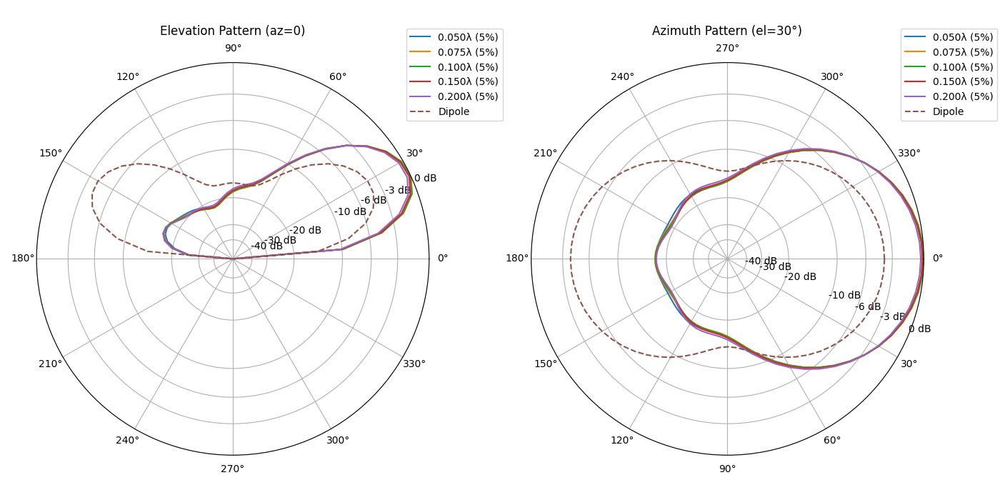
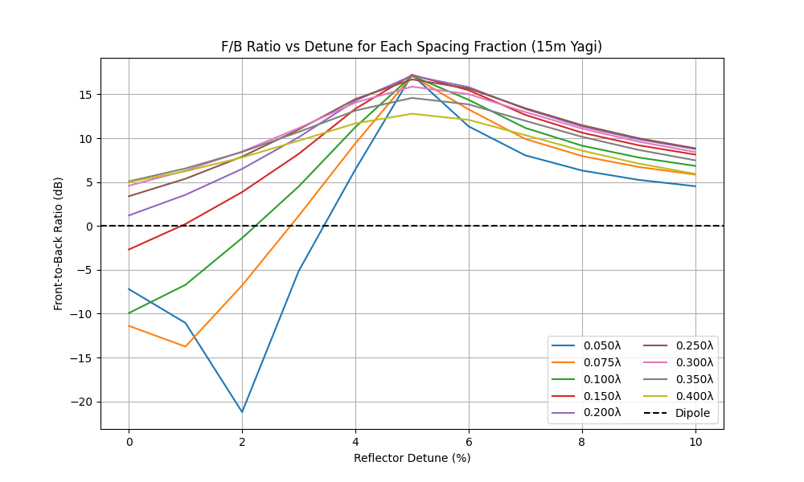

# Report for 2_el_yagi_15m

## Best Gain and F/B vs Boom Length

Parameters: frequency = 21.0 MHz; height = 7.14 m (~0.5λ); ground = average; segments = 21; radius = 0.001 m; elevation = 30° (azimuth pattern)

| Boom (ft, λ) | Max Gain (dBi) | Detune for Max Gain (%) | Max F/B (dB) | Detune for Max F/B (%) |
| --- | --- | --- | --- | --- |
| 2.0 (0.043λ) | 11.30 | 4.50 | 17.28 | 5.00 |
| 3.0 (0.064λ) | 11.27 | 4.50 | 17.13 | 5.00 |
| 4.0 (0.085λ) | 11.27 | 4.00 | 17.09 | 5.00 |
| 5.0 (0.107λ) | 11.26 | 4.00 | 17.13 | 5.00 |
| 6.0 (0.128λ) | 11.22 | 4.00 | 17.18 | 5.00 |
| 7.0 (0.149λ) | 11.19 | 3.50 | 17.22 | 5.00 |
| 8.0 (0.171λ) | 11.15 | 3.50 | 17.22 | 5.00 |
| 9.0 (0.192λ) | 11.09 | 3.00 | 17.16 | 5.00 |
| 10.0 (0.214λ) | 11.04 | 3.00 | 17.05 | 5.00 |

## Forward Gain vs Detune (%) and Spacing

Parameters: frequency = 21.0 MHz; detune steps = 0%–10% in 1% increments; spacing fractions = [0.05, 0.075, 0.1, 0.15, 0.2, 0.25, 0.3, 0.35, 0.4] λ; ground = average; segments = 21; radius = 0.001 m; height = 7.1 m (~0.5λ); elevation = 30°

| Detune (%) | Reflector Length (λ) | 0.05λ (2.3 ft) | 0.07λ (3.5 ft) | 0.10λ (4.7 ft) | 0.15λ (7.0 ft) | 0.20λ (9.4 ft) | 0.25λ (11.7 ft) | 0.30λ (14.1 ft) | 0.35λ (16.4 ft) | 0.40λ (18.7 ft) |
| --- | --- | --- | --- | --- | --- | --- | --- | --- | --- | --- |
| 0.00 | 0.500 | 2.54 | -0.86 | 0.91 | 7.31 | 9.50 | 10.18 | 10.33 | 10.21 | 9.89 |
| 1.00 | 0.505 | -0.70 | -2.70 | 4.19 | 9.18 | 10.36 | 10.62 | 10.57 | 10.34 | **9.94** |
| 2.00 | 0.510 | -10.09 | 4.27 | 8.41 | 10.53 | 10.89 | 10.86 | **10.68** | **10.36** | 9.89 |
| 3.00 | 0.515 | 5.78 | 9.76 | 10.74 | 11.12 | **11.07** | **10.91** | 10.64 | 10.27 | 9.72 |
| 4.00 | 0.520 | **11.08** | **11.26** | **11.27** | **11.17** | 11.01 | 10.80 | 10.50 | 10.07 | 9.45 |
| 5.00 | 0.525 | 11.07 | 11.09 | 11.07 | 10.98 | 10.83 | 10.60 | 10.28 | 9.81 | 9.11 |
| 6.00 | 0.530 | 10.44 | 10.64 | 10.72 | 10.71 | 10.60 | 10.38 | 10.04 | 9.52 | 8.74 |
| 7.00 | 0.535 | 9.93 | 10.24 | 10.38 | 10.45 | 10.36 | 10.15 | 9.79 | 9.23 | 8.37 |
| 8.00 | 0.540 | 9.56 | 9.91 | 10.09 | 10.21 | 10.15 | 9.93 | 9.55 | 8.96 | 8.04 |
| 9.00 | 0.545 | 9.28 | 9.65 | 9.85 | 10.01 | 9.95 | 9.73 | 9.34 | 8.72 | 7.76 |
| 10.00 | 0.550 | 9.07 | 9.44 | 9.65 | 9.82 | 9.78 | 9.56 | 9.16 | 8.51 | 7.52 |

## Front-to-Back Ratio vs Detune (%) and Spacing

Parameters: frequency = 21.0 MHz; detune steps = 0%–10% in 1% increments; spacing fractions = [0.05, 0.075, 0.1, 0.15, 0.2, 0.25, 0.3, 0.35, 0.4] λ; ground = average; segments = 21; radius = 0.001 m; height = 7.1 m (~0.5λ); elevation = 30°

| Detune (%) | Reflector Length (λ) | 0.05λ (2.3 ft) | 0.07λ (3.5 ft) | 0.10λ (4.7 ft) | 0.15λ (7.0 ft) | 0.20λ (9.4 ft) | 0.25λ (11.7 ft) | 0.30λ (14.1 ft) | 0.35λ (16.4 ft) | 0.40λ (18.7 ft) |
| --- | --- | --- | --- | --- | --- | --- | --- | --- | --- | --- |
| 0.00 | 0.500 | -7.20 | -11.39 | -9.93 | -2.69 | 1.19 | 3.38 | 4.58 | 5.08 | 4.99 |
| 1.00 | 0.505 | -11.06 | -13.75 | -6.71 | 0.22 | 3.55 | 5.38 | 6.31 | 6.56 | 6.23 |
| 2.00 | 0.510 | -21.22 | -6.78 | -1.38 | 3.86 | 6.50 | 7.90 | 8.48 | 8.43 | 7.81 |
| 3.00 | 0.515 | -5.13 | 1.16 | 4.50 | 8.22 | 10.11 | 10.99 | 11.15 | 10.71 | 9.71 |
| 4.00 | 0.520 | 6.45 | 9.42 | 11.26 | 13.36 | 14.28 | 14.47 | 14.07 | 13.15 | 11.69 |
| 5.00 | 0.525 | **17.24** | **17.10** | **17.11** | **17.22** | **17.13** | **16.70** | **15.87** | **14.59** | **12.79** |
| 6.00 | 0.530 | 11.34 | 13.28 | 14.38 | 15.47 | 15.82 | 15.67 | 15.02 | 13.86 | 12.09 |
| 7.00 | 0.535 | 8.05 | 9.91 | 11.17 | 12.66 | 13.33 | 13.42 | 12.98 | 11.98 | 10.35 |
| 8.00 | 0.540 | 6.32 | 7.97 | 9.15 | 10.63 | 11.35 | 11.49 | 11.10 | 10.16 | 8.58 |
| 9.00 | 0.545 | 5.25 | 6.72 | 7.80 | 9.19 | 9.87 | 10.00 | 9.60 | 8.67 | 7.11 |
| 10.00 | 0.550 | 4.53 | 5.85 | 6.84 | 8.14 | 8.76 | 8.85 | 8.43 | 7.48 | 5.93 |

## Half-wave Dipole Reference

Parameters: frequency = 21.0 MHz; height = 7.14 m (~0.5λ); ground = average; segments = 21; radius = 0.001 m; elevation = 30°

| Gain (dBi) | F/B (dB) |
| --- | --- |
| 7.25 | 0.00 |

## Polar Patterns (Max Gain per Spacing)

Parameters: frequency = 21.0 MHz; height = 7.1 m (~0.5λ); ground = average; segments = 21; radius = 0.001 m; elevation cut = 30°; dipole dashed

## Polar Patterns (Max F/B per Spacing)

Parameters: frequency = 21.0 MHz; height = 7.1 m (~0.5λ); ground = average; segments = 21; radius = 0.001 m; elevation cut = 30°; dipole dashed

## Forward Gain vs Detune for Each Spacing Fraction

Parameters: frequency = 21.0 MHz; height = 7.14 m (~0.5λ); ground = average; segments = 21; radius = 0.001 m; elevation = 30° (azimuth pattern)

## Front-to-Back Ratio vs Detune for Each Spacing Fraction

Parameters: frequency = 21.0 MHz; height = 7.14 m (~0.5λ); ground = average; segments = 21; radius = 0.001 m; elevation = 30° (azimuth pattern)

## Criticality Polar Patterns (0.050λ)

Parameters: frequency offsets = ±25, ±50, ±100 kHz; reflector detune optimized for max F/B; spacing = 0.050λ

## Criticality Data (0.050λ)

Parameters: spacing = 0.050λ; detune = 5.00%

| Offset (kHz) | Forward Gain (dBi) | F/B (dB) |
| --- | --- | --- |
| -100 | 11.06 | 17.36 |
| -50 | 11.06 | 17.30 |
| -25 | 11.07 | 17.27 |
| 0 | 11.07 | 17.24 |
| 25 | 11.07 | 17.21 |
| 50 | 11.08 | 17.18 |
| 100 | 11.08 | 17.11 |

## Criticality Polar Patterns (0.075λ)

Parameters: frequency offsets = ±25, ±50, ±100 kHz; reflector detune optimized for max F/B; spacing = 0.075λ

## Criticality Data (0.075λ)

Parameters: spacing = 0.075λ; detune = 5.00%

| Offset (kHz) | Forward Gain (dBi) | F/B (dB) |
| --- | --- | --- |
| -100 | 11.08 | 17.17 |
| -50 | 11.08 | 17.13 |
| -25 | 11.09 | 17.11 |
| 0 | 11.09 | 17.10 |
| 25 | 11.09 | 17.07 |
| 50 | 11.09 | 17.05 |
| 100 | 11.10 | 17.01 |

## Criticality Polar Patterns (0.100λ)

Parameters: frequency offsets = ±25, ±50, ±100 kHz; reflector detune optimized for max F/B; spacing = 0.100λ

## Criticality Data (0.100λ)

Parameters: spacing = 0.100λ; detune = 5.00%

| Offset (kHz) | Forward Gain (dBi) | F/B (dB) |
| --- | --- | --- |
| -100 | 11.06 | 17.17 |
| -50 | 11.06 | 17.14 |
| -25 | 11.07 | 17.13 |
| 0 | 11.07 | 17.11 |
| 25 | 11.07 | 17.10 |
| 50 | 11.07 | 17.08 |
| 100 | 11.08 | 17.05 |

## Criticality Polar Patterns (0.150λ)

Parameters: frequency offsets = ±25, ±50, ±100 kHz; reflector detune optimized for max F/B; spacing = 0.150λ

## Criticality Data (0.150λ)

Parameters: spacing = 0.150λ; detune = 5.00%

| Offset (kHz) | Forward Gain (dBi) | F/B (dB) |
| --- | --- | --- |
| -100 | 10.97 | 17.24 |
| -50 | 10.97 | 17.23 |
| -25 | 10.98 | 17.23 |
| 0 | 10.98 | 17.22 |
| 25 | 10.98 | 17.21 |
| 50 | 10.98 | 17.20 |
| 100 | 10.99 | 17.18 |

## VSWR vs Frequency (All Spacings)

Parameters: Spacing fractions = 0.05-0.40 λ; reflector detune set for max F/B at 21 MHz; height = 0.5 λ; 50 Ω reference

## Feedpoint Impedance vs Frequency (0.050λ)

Parameters: spacing = 0.050λ; detune = 5.00%

| Offset (kHz) | R (Ω) | X (Ω) |
| --- | --- | --- |
| -300 | 6.6 | -31.7 |
| -275 | 6.6 | -31.7 |
| -250 | 6.7 | -31.6 |
| -225 | 6.7 | -31.6 |
| -200 | 6.7 | -31.6 |
| -175 | 6.7 | -31.5 |
| -150 | 6.7 | -31.5 |
| -125 | 6.7 | -31.5 |
| -100 | 6.8 | -31.4 |
| -75 | 6.8 | -31.4 |
| -50 | 6.8 | -31.4 |
| -25 | 6.8 | -31.3 |
| 0 | 6.8 | -31.3 |
| 25 | 6.8 | -31.3 |
| 50 | 6.9 | -31.3 |
| 75 | 6.9 | -31.2 |
| 100 | 6.9 | -31.2 |
| 125 | 6.9 | -31.2 |
| 150 | 6.9 | -31.1 |
| 175 | 6.9 | -31.1 |
| 200 | 7.0 | -31.1 |
| 225 | 7.0 | -31.0 |
| 250 | 7.0 | -31.0 |
| 275 | 7.0 | -31.0 |
| 300 | 7.0 | -31.0 |

## Feedpoint Impedance vs Frequency (0.075λ)

Parameters: spacing = 0.075λ; detune = 5.00%

| Offset (kHz) | R (Ω) | X (Ω) |
| --- | --- | --- |
| -300 | 13.8 | -20.5 |
| -275 | 13.8 | -20.5 |
| -250 | 13.8 | -20.5 |
| -225 | 13.9 | -20.4 |
| -200 | 13.9 | -20.4 |
| -175 | 13.9 | -20.4 |
| -150 | 14.0 | -20.4 |
| -125 | 14.0 | -20.3 |
| -100 | 14.0 | -20.3 |
| -75 | 14.1 | -20.3 |
| -50 | 14.1 | -20.2 |
| -25 | 14.1 | -20.2 |
| 0 | 14.2 | -20.2 |
| 25 | 14.2 | -20.1 |
| 50 | 14.2 | -20.1 |
| 75 | 14.3 | -20.1 |
| 100 | 14.3 | -20.0 |
| 125 | 14.3 | -20.0 |
| 150 | 14.4 | -20.0 |
| 175 | 14.4 | -20.0 |
| 200 | 14.4 | -19.9 |
| 225 | 14.4 | -19.9 |
| 250 | 14.5 | -19.9 |
| 275 | 14.5 | -19.8 |
| 300 | 14.5 | -19.8 |

## Feedpoint Impedance vs Frequency (0.100λ)

Parameters: spacing = 0.100λ; detune = 5.00%

| Offset (kHz) | R (Ω) | X (Ω) |
| --- | --- | --- |
| -300 | 23.1 | -11.1 |
| -275 | 23.2 | -11.1 |
| -250 | 23.3 | -11.0 |
| -225 | 23.3 | -11.0 |
| -200 | 23.3 | -11.0 |
| -175 | 23.4 | -11.0 |
| -150 | 23.5 | -11.0 |
| -125 | 23.5 | -10.9 |
| -100 | 23.6 | -10.9 |
| -75 | 23.6 | -10.9 |
| -50 | 23.7 | -10.9 |
| -25 | 23.7 | -10.9 |
| 0 | 23.8 | -10.8 |
| 25 | 23.8 | -10.8 |
| 50 | 23.9 | -10.8 |
| 75 | 23.9 | -10.8 |
| 100 | 23.9 | -10.8 |
| 125 | 24.0 | -10.8 |
| 150 | 24.0 | -10.7 |
| 175 | 24.1 | -10.7 |
| 200 | 24.1 | -10.7 |
| 225 | 24.2 | -10.7 |
| 250 | 24.2 | -10.7 |
| 275 | 24.3 | -10.6 |
| 300 | 24.3 | -10.6 |

## Feedpoint Impedance vs Frequency (0.150λ)

Parameters: spacing = 0.150λ; detune = 5.00%

| Offset (kHz) | R (Ω) | X (Ω) |
| --- | --- | --- |
| -300 | 46.0 | -0.1 |
| -275 | 46.1 | -0.1 |
| -250 | 46.2 | -0.1 |
| -225 | 46.3 | -0.2 |
| -200 | 46.3 | -0.2 |
| -175 | 46.4 | -0.2 |
| -150 | 46.5 | -0.3 |
| -125 | 46.6 | -0.3 |
| -100 | 46.6 | -0.3 |
| -75 | 46.7 | -0.4 |
| -50 | 46.8 | -0.4 |
| -25 | 46.8 | -0.4 |
| 0 | 46.9 | -0.5 |
| 25 | 47.0 | -0.5 |
| 50 | 47.1 | -0.5 |
| 75 | 47.1 | -0.6 |
| 100 | 47.2 | -0.6 |
| 125 | 47.3 | -0.6 |
| 150 | 47.3 | -0.7 |
| 175 | 47.4 | -0.7 |
| 200 | 47.5 | -0.7 |
| 225 | 47.5 | -0.8 |
| 250 | 47.6 | -0.8 |
| 275 | 47.6 | -0.9 |
| 300 | 47.7 | -0.9 |

## Feedpoint Impedance vs Frequency (0.200λ)

Parameters: spacing = 0.200λ; detune = 5.00%

| Offset (kHz) | R (Ω) | X (Ω) |
| --- | --- | --- |
| -300 | 69.4 | -0.8 |
| -275 | 69.5 | -0.9 |
| -250 | 69.6 | -1.0 |
| -225 | 69.6 | -1.1 |
| -200 | 69.7 | -1.2 |
| -175 | 69.8 | -1.3 |
| -150 | 69.8 | -1.4 |
| -125 | 69.9 | -1.5 |
| -100 | 69.9 | -1.7 |
| -75 | 70.0 | -1.8 |
| -50 | 70.0 | -1.9 |
| -25 | 70.1 | -2.0 |
| 0 | 70.2 | -2.1 |
| 25 | 70.2 | -2.2 |
| 50 | 70.3 | -2.3 |
| 75 | 70.3 | -2.4 |
| 100 | 70.4 | -2.5 |
| 125 | 70.4 | -2.7 |
| 150 | 70.5 | -2.8 |
| 175 | 70.5 | -2.9 |
| 200 | 70.5 | -3.0 |
| 225 | 70.6 | -3.1 |
| 250 | 70.6 | -3.2 |
| 275 | 70.7 | -3.3 |
| 300 | 70.7 | -3.4 |

## Feedpoint Impedance vs Frequency (0.250λ)

Parameters: spacing = 0.250λ; detune = 5.00%

| Offset (kHz) | R (Ω) | X (Ω) |
| --- | --- | --- |
| -300 | 88.0 | -11.4 |
| -275 | 88.0 | -11.6 |
| -250 | 88.0 | -11.7 |
| -225 | 88.0 | -11.9 |
| -200 | 88.0 | -12.1 |
| -175 | 88.0 | -12.3 |
| -150 | 88.0 | -12.5 |
| -125 | 88.0 | -12.7 |
| -100 | 88.0 | -12.9 |
| -75 | 88.0 | -13.0 |
| -50 | 88.0 | -13.2 |
| -25 | 88.0 | -13.4 |
| 0 | 88.0 | -13.6 |
| 25 | 87.9 | -13.8 |
| 50 | 87.9 | -14.0 |
| 75 | 87.9 | -14.1 |
| 100 | 87.9 | -14.3 |
| 125 | 87.9 | -14.5 |
| 150 | 87.8 | -14.7 |
| 175 | 87.8 | -14.9 |
| 200 | 87.8 | -15.0 |
| 225 | 87.8 | -15.2 |
| 250 | 87.7 | -15.4 |
| 275 | 87.7 | -15.6 |
| 300 | 87.7 | -15.7 |

## Feedpoint Impedance vs Frequency (0.300λ)

Parameters: spacing = 0.300λ; detune = 5.00%

| Offset (kHz) | R (Ω) | X (Ω) |
| --- | --- | --- |
| -300 | 98.3 | -27.8 |
| -275 | 98.2 | -28.0 |
| -250 | 98.1 | -28.3 |
| -225 | 98.0 | -28.5 |
| -200 | 97.9 | -28.7 |
| -175 | 97.8 | -29.0 |
| -150 | 97.7 | -29.2 |
| -125 | 97.6 | -29.4 |
| -100 | 97.5 | -29.6 |
| -75 | 97.4 | -29.9 |
| -50 | 97.3 | -30.1 |
| -25 | 97.2 | -30.3 |
| 0 | 97.1 | -30.5 |
| 25 | 96.9 | -30.7 |
| 50 | 96.8 | -31.0 |
| 75 | 96.7 | -31.2 |
| 100 | 96.6 | -31.4 |
| 125 | 96.5 | -31.6 |
| 150 | 96.3 | -31.8 |
| 175 | 96.2 | -32.0 |
| 200 | 96.1 | -32.2 |
| 225 | 95.9 | -32.4 |
| 250 | 95.8 | -32.6 |
| 275 | 95.7 | -32.8 |
| 300 | 95.5 | -33.0 |

## Feedpoint Impedance vs Frequency (0.350λ)

Parameters: spacing = 0.350λ; detune = 5.00%

| Offset (kHz) | R (Ω) | X (Ω) |
| --- | --- | --- |
| -300 | 99.6 | -45.4 |
| -275 | 99.4 | -45.7 |
| -250 | 99.2 | -45.9 |
| -225 | 99.0 | -46.1 |
| -200 | 98.8 | -46.3 |
| -175 | 98.6 | -46.5 |
| -150 | 98.3 | -46.8 |
| -125 | 98.1 | -47.0 |
| -100 | 97.9 | -47.2 |
| -75 | 97.7 | -47.4 |
| -50 | 97.5 | -47.6 |
| -25 | 97.2 | -47.8 |
| 0 | 97.0 | -48.0 |
| 25 | 96.8 | -48.2 |
| 50 | 96.5 | -48.4 |
| 75 | 96.3 | -48.6 |
| 100 | 96.1 | -48.8 |
| 125 | 95.8 | -49.0 |
| 150 | 95.6 | -49.2 |
| 175 | 95.3 | -49.4 |
| 200 | 95.1 | -49.5 |
| 225 | 94.9 | -49.7 |
| 250 | 94.6 | -49.9 |
| 275 | 94.4 | -50.1 |
| 300 | 94.1 | -50.2 |

## Feedpoint Impedance vs Frequency (0.400λ)

Parameters: spacing = 0.400λ; detune = 5.00%

| Offset (kHz) | R (Ω) | X (Ω) |
| --- | --- | --- |
| -300 | 93.3 | -60.3 |
| -275 | 92.9 | -60.4 |
| -250 | 92.6 | -60.6 |
| -225 | 92.3 | -60.7 |
| -200 | 92.0 | -60.9 |
| -175 | 91.7 | -61.1 |
| -150 | 91.4 | -61.2 |
| -125 | 91.0 | -61.4 |
| -100 | 90.7 | -61.5 |
| -75 | 90.4 | -61.7 |
| -50 | 90.1 | -61.8 |
| -25 | 89.7 | -61.9 |
| 0 | 89.4 | -62.1 |
| 25 | 89.1 | -62.2 |
| 50 | 88.8 | -62.4 |
| 75 | 88.4 | -62.5 |
| 100 | 88.1 | -62.6 |
| 125 | 87.8 | -62.7 |
| 150 | 87.4 | -62.8 |
| 175 | 87.1 | -62.9 |
| 200 | 86.7 | -63.1 |
| 225 | 86.4 | -63.2 |
| 250 | 86.1 | -63.3 |
| 275 | 85.7 | -63.4 |
| 300 | 85.4 | -63.5 |

## Pattern Comparison Original vs Scaled (0.050λ)

Parameters: scale factor = 1.0171; R=16.4 Ω, X=0.1 Ω

## Pattern Comparison Original vs Scaled (0.075λ)

Parameters: scale factor = 1.0111; R=22.0 Ω, X=0.1 Ω

## Pattern Comparison Original vs Scaled (0.100λ)

Parameters: scale factor = 1.0063; R=28.9 Ω, X=0.1 Ω

## Rescaled Element Lengths for X≈0

Parameters: Lengths scaled uniformly so that feedpoint reactance ~0 at 21 MHz; detune held constant.

| Spacing λ | Scale Factor | Driven Len (m) | Reflector Len (m) | R (Ω) | X (Ω) |
| --- | --- | --- | --- | --- | --- |
| 0.050 | 1.0171 | 6.909 | 7.254 | 16.4 | 0.1 |
| 0.075 | 1.0111 | 6.868 | 7.211 | 22.0 | 0.1 |
| 0.100 | 1.0063 | 6.835 | 7.177 | 28.9 | 0.1 |

## Original Element Lengths and Impedances for Spacings 0.05,0.075,0.10 λ

Parameters: Lengths and impedances for original unscaled element lengths

| Spacing λ | Driven Len (m) | Reflector Len (m) | R (Ω) | X (Ω) |
| --- | --- | --- | --- | --- |
| 0.050 | 6.793 | 7.132 | 6.8 | -31.3 |
| 0.075 | 6.793 | 7.132 | 14.2 | -20.2 |
| 0.100 | 6.793 | 7.132 | 23.8 | -10.8 |

## Optimised Detune with X≤3Ω

Parameters: Scaled driven element (X≈0), reflector detune tweaked ±2 % to maximise F/B while |X|≤3 Ω.

| Spacing λ | Scale | Detune % | R (Ω) | X (Ω) | Gain (dBi) | F/B (dB) |
| --- | --- | --- | --- | --- | --- | --- |
| 0.050 | 1.0171 | 4.50 | 13.5 | -1.9 | 10.34 | 10.37 |
| 0.075 | 1.0111 | 4.50 | 18.6 | -1.9 | 10.82 | 14.94 |
| 0.100 | 1.0063 | 4.50 | 25.2 | -1.5 | 11.02 | 17.04 |
