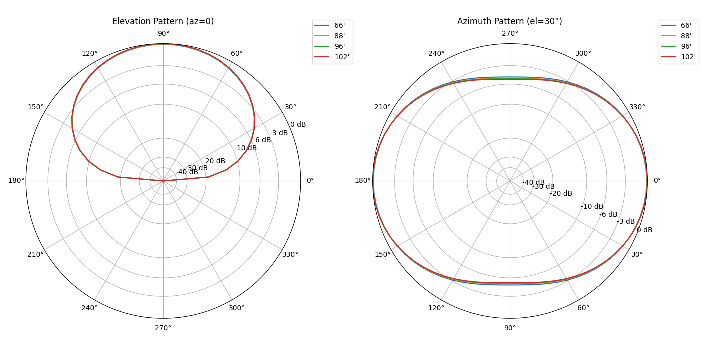
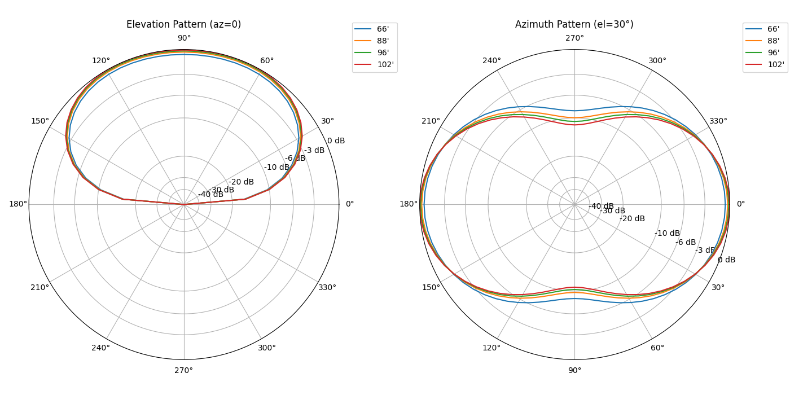

# Report for 40_80_multiband

## Feedpoint Impedance at 10m (f=3.5 MHz)

Parameters: frequency = 3.5 MHz; height = 10 m; ground = average; segments = 21; radius = 0.001 m

| Length (ft) | Length (m) | R (Ω) | X (Ω) |
| --- | --- | --- | --- |
| 66' | 20.12 | 4.42 | -1071.62 |
| 88' | 26.82 | 8.59 | -654.92 |
| 96' | 29.26 | 10.64 | -531.19 |
| 102' | 31.09 | 12.41 | -444.00 |

## Gain at az=0 for Elevation 0–180° (f=3.5 MHz)

Parameters: frequency = 3.5 MHz; height = 10 m; ground = average; segments = 21; radius = 0.001 m; azimuth = 0°

| Elevation (deg) | 66' | 88' | 96' | 102' |
| --- | --- | --- | --- | --- |
| 0 | -999.000 | -999.000 | -999.000 | -999.000 |
| 5 | -10.742 | -10.693 | -10.672 | -10.654 |
| 10 | -4.895 | -4.847 | -4.825 | -4.808 |
| 15 | -1.582 | -1.534 | -1.512 | -1.495 |
| 20 | 0.675 | 0.723 | 0.745 | 0.763 |
| 25 | 2.341 | 2.390 | 2.411 | 2.429 |
| 30 | 3.625 | 3.673 | 3.694 | 3.712 |
| 35 | 4.637 | 4.686 | 4.707 | 4.725 |
| 40 | 5.448 | 5.496 | 5.518 | 5.535 |
| 45 | 6.101 | 6.149 | 6.171 | 6.189 |
| 50 | 6.629 | 6.677 | 6.698 | 6.716 |
| 55 | 7.053 | 7.101 | 7.123 | 7.141 |
| 60 | 7.393 | 7.441 | 7.462 | 7.480 |
| 65 | 7.660 | 7.708 | 7.730 | 7.747 |
| 70 | 7.866 | 7.914 | 7.936 | 7.953 |
| 75 | 8.018 | 8.067 | 8.088 | 8.106 |
| 80 | 8.123 | 8.171 | 8.193 | 8.211 |
| 85 | 8.184 | 8.233 | 8.254 | 8.272 |
| 90 | **8.205** | **8.253** | **8.274** | **8.292** |
| 95 | 8.184 | 8.233 | 8.254 | 8.272 |
| 100 | 8.123 | 8.171 | 8.193 | 8.211 |
| 105 | 8.018 | 8.067 | 8.088 | 8.106 |
| 110 | 7.866 | 7.914 | 7.936 | 7.953 |
| 115 | 7.660 | 7.708 | 7.730 | 7.747 |
| 120 | 7.393 | 7.441 | 7.462 | 7.480 |
| 125 | 7.053 | 7.101 | 7.123 | 7.141 |
| 130 | 6.629 | 6.677 | 6.698 | 6.716 |
| 135 | 6.101 | 6.149 | 6.171 | 6.189 |
| 140 | 5.448 | 5.496 | 5.518 | 5.535 |
| 145 | 4.637 | 4.686 | 4.707 | 4.725 |
| 150 | 3.625 | 3.673 | 3.694 | 3.712 |
| 155 | 2.341 | 2.390 | 2.411 | 2.429 |
| 160 | 0.675 | 0.723 | 0.745 | 0.763 |
| 165 | -1.582 | -1.534 | -1.512 | -1.495 |
| 170 | -4.895 | -4.847 | -4.825 | -4.808 |
| 175 | -10.742 | -10.693 | -10.672 | -10.654 |
| 180 | -999.000 | -999.000 | -999.000 | -999.000 |

## Azimuth Gain at el=30° (f=3.5 MHz)

Parameters: frequency = 3.5 MHz; height = 10.0 m; ground = average; segments = 21; radius = 0.001 m; elevation = 30°

| Azimuth (deg) | 66' | 88' | 96' | 102' |
| --- | --- | --- | --- | --- |
| 0.0 | 3.625 | 3.673 | 3.694 | 3.712 |
| 5.0 | 3.601 | 3.648 | 3.669 | 3.686 |
| 10.0 | 3.531 | 3.572 | 3.590 | 3.605 |
| 15.0 | 3.415 | 3.447 | 3.461 | 3.472 |
| 20.0 | 3.253 | 3.272 | 3.281 | 3.288 |
| 25.0 | 3.047 | 3.050 | 3.052 | 3.053 |
| 30.0 | 2.797 | 2.782 | 2.775 | 2.770 |
| 35.0 | 2.505 | 2.470 | 2.455 | 2.442 |
| 40.0 | 2.175 | 2.119 | 2.093 | 2.072 |
| 45.0 | 1.810 | 1.732 | 1.697 | 1.668 |
| 50.0 | 1.417 | 1.317 | 1.272 | 1.234 |
| 55.0 | 1.004 | 0.882 | 0.827 | 0.781 |
| 60.0 | 0.582 | 0.440 | 0.375 | 0.322 |
| 65.0 | 0.166 | 0.005 | -0.068 | -0.128 |
| 70.0 | -0.225 | -0.401 | -0.481 | -0.547 |
| 75.0 | -0.567 | -0.756 | -0.842 | -0.913 |
| 80.0 | -0.836 | -1.034 | -1.125 | -1.199 |
| 85.0 | -1.008 | -1.213 | -1.306 | -1.382 |
| 90.0 | -1.068 | -1.274 | -1.368 | -1.445 |
| 95.0 | -1.008 | -1.213 | -1.306 | -1.382 |
| 100.0 | -0.836 | -1.034 | -1.125 | -1.199 |
| 105.0 | -0.567 | -0.756 | -0.842 | -0.913 |
| 110.0 | -0.225 | -0.401 | -0.481 | -0.547 |
| 115.0 | 0.166 | 0.005 | -0.068 | -0.128 |
| 120.0 | 0.582 | 0.440 | 0.375 | 0.322 |
| 125.0 | 1.004 | 0.882 | 0.827 | 0.781 |
| 130.0 | 1.417 | 1.317 | 1.272 | 1.234 |
| 135.0 | 1.810 | 1.732 | 1.697 | 1.668 |
| 140.0 | 2.175 | 2.119 | 2.093 | 2.072 |
| 145.0 | 2.505 | 2.470 | 2.455 | 2.442 |
| 150.0 | 2.797 | 2.782 | 2.775 | 2.770 |
| 155.0 | 3.047 | 3.050 | 3.052 | 3.053 |
| 160.0 | 3.253 | 3.272 | 3.281 | 3.288 |
| 165.0 | 3.415 | 3.447 | 3.461 | 3.472 |
| 170.0 | 3.531 | 3.572 | 3.590 | 3.605 |
| 175.0 | 3.601 | 3.648 | 3.669 | 3.686 |
| 180.0 | 3.625 | 3.673 | 3.694 | 3.712 |
| 185.0 | 3.601 | 3.648 | 3.668 | 3.685 |
| 190.0 | 3.531 | 3.572 | 3.590 | 3.605 |
| 195.0 | 3.415 | 3.446 | 3.460 | 3.471 |
| 200.0 | 3.253 | 3.272 | 3.280 | 3.286 |
| 205.0 | 3.046 | 3.049 | 3.050 | 3.051 |
| 210.0 | 2.796 | 2.781 | 2.773 | 2.767 |
| 215.0 | 2.505 | 2.469 | 2.453 | 2.439 |
| 220.0 | 2.174 | 2.117 | 2.091 | 2.070 |
| 225.0 | 1.810 | 1.731 | 1.694 | 1.664 |
| 230.0 | 1.417 | 1.315 | 1.269 | 1.230 |
| 235.0 | 1.003 | 0.880 | 0.824 | 0.777 |
| 240.0 | 0.581 | 0.437 | 0.372 | 0.318 |
| 245.0 | 0.165 | 0.003 | -0.071 | -0.132 |
| 250.0 | -0.226 | -0.404 | -0.485 | -0.552 |
| 255.0 | -0.568 | -0.759 | -0.845 | -0.917 |
| 260.0 | -0.836 | -1.037 | -1.128 | -1.204 |
| 265.0 | -1.009 | -1.215 | -1.309 | -1.387 |
| 270.0 | -1.069 | -1.277 | -1.372 | -1.450 |
| 275.0 | -1.009 | -1.215 | -1.309 | -1.387 |
| 280.0 | -0.836 | -1.037 | -1.128 | -1.204 |
| 285.0 | -0.568 | -0.759 | -0.845 | -0.917 |
| 290.0 | -0.226 | -0.404 | -0.485 | -0.552 |
| 295.0 | 0.165 | 0.003 | -0.071 | -0.132 |
| 300.0 | 0.581 | 0.437 | 0.372 | 0.318 |
| 305.0 | 1.003 | 0.880 | 0.824 | 0.777 |
| 310.0 | 1.417 | 1.315 | 1.269 | 1.230 |
| 315.0 | 1.810 | 1.731 | 1.694 | 1.664 |
| 320.0 | 2.174 | 2.117 | 2.091 | 2.070 |
| 325.0 | 2.505 | 2.469 | 2.453 | 2.439 |
| 330.0 | 2.796 | 2.781 | 2.773 | 2.767 |
| 335.0 | 3.046 | 3.049 | 3.050 | 3.051 |
| 340.0 | 3.253 | 3.272 | 3.280 | 3.286 |
| 345.0 | 3.415 | 3.446 | 3.460 | 3.471 |
| 350.0 | 3.531 | 3.572 | 3.590 | 3.605 |
| 355.0 | 3.601 | 3.648 | 3.668 | 3.685 |
| 360.0 | 3.625 | 3.673 | 3.694 | 3.712 |

## Polar Patterns (f=3.5 MHz)

Parameters: frequency = 3.5 MHz; height = 10.0 m; ground = average; segments = 21; radius = 0.001 m; el=30°; az=0°

## Feedpoint Impedance at 10m (f=7.1 MHz)

Parameters: frequency = 7.1 MHz; height = 10 m; ground = average; segments = 21; radius = 0.001 m

| Length (ft) | Length (m) | R (Ω) | X (Ω) |
| --- | --- | --- | --- |
| 66' | 20.12 | 76.85 | -6.42 |
| 88' | 26.82 | 235.14 | 631.94 |
| 96' | 29.26 | 381.09 | 962.12 |
| 102' | 31.09 | 580.29 | 1284.06 |

## Gain at az=0 for Elevation 0–180° (f=7.1 MHz)

Parameters: frequency = 7.1 MHz; height = 10 m; ground = average; segments = 21; radius = 0.001 m; azimuth = 0°

| Elevation (deg) | 66' | 88' | 96' | 102' |
| --- | --- | --- | --- | --- |
| 0 | -999.000 | -999.000 | -999.000 | -999.000 |
| 5 | -9.640 | -9.372 | -9.245 | -9.140 |
| 10 | -3.898 | -3.630 | -3.504 | -3.399 |
| 15 | -0.727 | -0.459 | -0.332 | -0.227 |
| 20 | 1.355 | 1.623 | 1.750 | 1.855 |
| 25 | 2.815 | 3.082 | 3.209 | 3.314 |
| 30 | 3.864 | 4.132 | 4.259 | 4.364 |
| 35 | 4.622 | 4.890 | 5.017 | 5.122 |
| 40 | 5.163 | 5.430 | 5.557 | 5.662 |
| 45 | 5.536 | 5.804 | 5.931 | 6.036 |
| 50 | 5.783 | 6.051 | 6.177 | 6.282 |
| 55 | 5.933 | 6.201 | 6.327 | 6.433 |
| 60 | 6.012 | 6.280 | 6.407 | 6.512 |
| 65 | **6.042** | **6.310** | **6.437** | **6.542** |
| 70 | 6.041 | 6.309 | 6.435 | 6.540 |
| 75 | 6.024 | 6.292 | 6.418 | 6.523 |
| 80 | 6.003 | 6.271 | 6.397 | 6.502 |
| 85 | 5.987 | 6.255 | 6.381 | 6.486 |
| 90 | 5.981 | 6.249 | 6.375 | 6.480 |
| 95 | 5.987 | 6.255 | 6.381 | 6.486 |
| 100 | 6.003 | 6.271 | 6.397 | 6.502 |
| 105 | 6.024 | 6.292 | 6.418 | 6.523 |
| 110 | 6.041 | 6.309 | 6.435 | 6.540 |
| 115 | **6.042** | **6.310** | **6.437** | **6.542** |
| 120 | 6.012 | 6.280 | 6.407 | 6.512 |
| 125 | 5.933 | 6.201 | 6.327 | 6.433 |
| 130 | 5.783 | 6.051 | 6.177 | 6.282 |
| 135 | 5.536 | 5.804 | 5.931 | 6.036 |
| 140 | 5.163 | 5.430 | 5.557 | 5.662 |
| 145 | 4.622 | 4.890 | 5.017 | 5.122 |
| 150 | 3.864 | 4.132 | 4.259 | 4.364 |
| 155 | 2.815 | 3.082 | 3.209 | 3.314 |
| 160 | 1.355 | 1.623 | 1.750 | 1.855 |
| 165 | -0.727 | -0.459 | -0.332 | -0.227 |
| 170 | -3.898 | -3.630 | -3.504 | -3.399 |
| 175 | -9.640 | -9.372 | -9.245 | -9.140 |
| 180 | -999.000 | -999.000 | -999.000 | -999.000 |

## Azimuth Gain at el=30° (f=7.1 MHz)

Parameters: frequency = 7.1 MHz; height = 10.0 m; ground = average; segments = 21; radius = 0.001 m; elevation = 30°

| Azimuth (deg) | 66' | 88' | 96' | 102' |
| --- | --- | --- | --- | --- |
| 0.0 | 3.864 | 4.132 | 4.259 | 4.364 |
| 5.0 | 3.830 | 4.093 | 4.220 | 4.327 |
| 10.0 | 3.722 | 3.960 | 4.076 | 4.177 |
| 15.0 | 3.541 | 3.734 | 3.830 | 3.916 |
| 20.0 | 3.289 | 3.418 | 3.484 | 3.547 |
| 25.0 | 2.966 | 3.013 | 3.042 | 3.075 |
| 30.0 | 2.574 | 2.525 | 2.508 | 2.504 |
| 35.0 | 2.114 | 1.958 | 1.888 | 1.841 |
| 40.0 | 1.590 | 1.316 | 1.189 | 1.094 |
| 45.0 | 1.005 | 0.608 | 0.420 | 0.274 |
| 50.0 | 0.365 | -0.159 | -0.409 | -0.608 |
| 55.0 | -0.323 | -0.971 | -1.285 | -1.536 |
| 60.0 | -1.047 | -1.813 | -2.187 | -2.490 |
| 65.0 | -1.786 | -2.661 | -3.091 | -3.442 |
| 70.0 | -2.512 | -3.481 | -3.961 | -4.354 |
| 75.0 | -3.179 | -4.226 | -4.747 | -5.175 |
| 80.0 | -3.729 | -4.835 | -5.386 | -5.840 |
| 85.0 | -4.097 | -5.238 | -5.809 | -6.279 |
| 90.0 | -4.227 | -5.380 | -5.957 | -6.433 |
| 95.0 | -4.097 | -5.238 | -5.809 | -6.279 |
| 100.0 | -3.729 | -4.835 | -5.386 | -5.840 |
| 105.0 | -3.179 | -4.226 | -4.747 | -5.175 |
| 110.0 | -2.512 | -3.481 | -3.961 | -4.354 |
| 115.0 | -1.786 | -2.661 | -3.091 | -3.442 |
| 120.0 | -1.047 | -1.813 | -2.187 | -2.490 |
| 125.0 | -0.323 | -0.971 | -1.285 | -1.536 |
| 130.0 | 0.365 | -0.159 | -0.409 | -0.608 |
| 135.0 | 1.005 | 0.608 | 0.420 | 0.274 |
| 140.0 | 1.590 | 1.316 | 1.189 | 1.094 |
| 145.0 | 2.114 | 1.958 | 1.888 | 1.841 |
| 150.0 | 2.574 | 2.525 | 2.508 | 2.504 |
| 155.0 | 2.966 | 3.013 | 3.042 | 3.075 |
| 160.0 | 3.289 | 3.418 | 3.484 | 3.547 |
| 165.0 | 3.541 | 3.734 | 3.830 | 3.916 |
| 170.0 | 3.722 | 3.960 | 4.076 | 4.177 |
| 175.0 | 3.830 | 4.093 | 4.220 | 4.327 |
| 180.0 | 3.864 | 4.132 | 4.259 | 4.364 |
| 185.0 | 3.826 | 4.077 | 4.194 | 4.288 |
| 190.0 | 3.714 | 3.929 | 4.025 | 4.099 |
| 195.0 | 3.530 | 3.688 | 3.753 | 3.799 |
| 200.0 | 3.274 | 3.356 | 3.381 | 3.390 |
| 205.0 | 2.947 | 2.936 | 2.912 | 2.877 |
| 210.0 | 2.551 | 2.433 | 2.352 | 2.264 |
| 215.0 | 2.088 | 1.850 | 1.705 | 1.558 |
| 220.0 | 1.561 | 1.193 | 0.978 | 0.768 |
| 225.0 | 0.973 | 0.470 | 0.181 | -0.097 |
| 230.0 | 0.330 | -0.311 | -0.675 | -1.024 |
| 235.0 | -0.361 | -1.137 | -1.576 | -1.996 |
| 240.0 | -1.087 | -1.992 | -2.503 | -2.992 |
| 245.0 | -1.829 | -2.851 | -3.430 | -3.983 |
| 250.0 | -2.556 | -3.681 | -4.320 | -4.931 |
| 255.0 | -3.225 | -4.435 | -5.123 | -5.782 |
| 260.0 | -3.776 | -5.049 | -5.774 | -6.469 |
| 265.0 | -4.144 | -5.456 | -6.204 | -6.922 |
| 270.0 | -4.275 | -5.600 | -6.355 | -7.081 |
| 275.0 | -4.144 | -5.456 | -6.204 | -6.922 |
| 280.0 | -3.776 | -5.049 | -5.774 | -6.469 |
| 285.0 | -3.225 | -4.435 | -5.123 | -5.782 |
| 290.0 | -2.556 | -3.681 | -4.320 | -4.931 |
| 295.0 | -1.829 | -2.851 | -3.430 | -3.983 |
| 300.0 | -1.087 | -1.992 | -2.503 | -2.992 |
| 305.0 | -0.361 | -1.137 | -1.576 | -1.996 |
| 310.0 | 0.330 | -0.311 | -0.675 | -1.024 |
| 315.0 | 0.973 | 0.470 | 0.181 | -0.097 |
| 320.0 | 1.561 | 1.193 | 0.978 | 0.768 |
| 325.0 | 2.088 | 1.850 | 1.705 | 1.558 |
| 330.0 | 2.551 | 2.433 | 2.352 | 2.264 |
| 335.0 | 2.947 | 2.936 | 2.912 | 2.877 |
| 340.0 | 3.274 | 3.356 | 3.381 | 3.390 |
| 345.0 | 3.530 | 3.688 | 3.753 | 3.799 |
| 350.0 | 3.714 | 3.929 | 4.025 | 4.099 |
| 355.0 | 3.826 | 4.077 | 4.194 | 4.288 |
| 360.0 | 3.864 | 4.132 | 4.259 | 4.364 |

## Polar Patterns (f=7.1 MHz)

Parameters: frequency = 7.1 MHz; height = 10.0 m; ground = average; segments = 21; radius = 0.001 m; el=30°; az=0°

