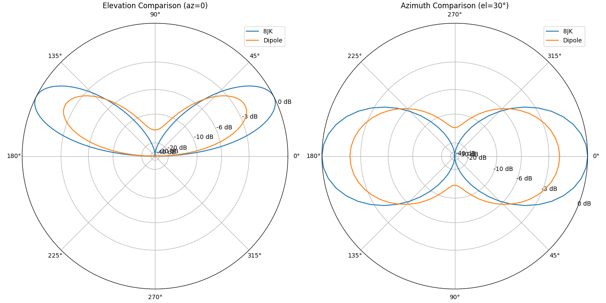

# Report for 8_jk

## Feedpoint Impedance vs Height

| Height (m) | R (Ω) | X (Ω) |
| --- | --- | --- |
| 5.0 | 85.15495 | 620.5207 |
| 10.0 | 127.8211 | 586.0678 |
| 15.0 | 107.7499 | 589.6409 |
| 20.0 | 118.159 | 591.3761 |

## Gain at az=0 for Elevation 0–180°

| Elevation (deg) | 5.0 m | 10.0 m | 15.0 m | 20.0 m |
| --- | --- | --- | --- | --- |
| 0 | -999.000 | -999.000 | -299.624 | -297.353 |
| 5 | -4.311 | -0.542 | 3.529 | 5.425 |
| 10 | 1.330 | 4.876 | 8.570 | 9.923 |
| 15 | 4.354 | 7.526 | 10.566 | **10.908** |
| 20 | 6.235 | 8.885 | **10.943** | 9.555 |
| 25 | 7.438 | **9.411** | 10.066 | 5.494 |
| 30 | 8.166 | 9.308 | 7.953 | -4.275 |
| 35 | 8.525 | 8.679 | 4.313 | -0.853 |
| 40 | **8.578** | 7.584 | -1.640 | 4.875 |
| 45 | 8.357 | 6.056 | -6.348 | 6.788 |
| 50 | 7.878 | 4.117 | -1.656 | 6.912 |
| 55 | 7.140 | 1.784 | 1.146 | 5.865 |
| 60 | 6.125 | -0.920 | 2.144 | 3.912 |
| 65 | 4.783 | -3.954 | 1.991 | 1.193 |
| 70 | 3.022 | -7.270 | 0.933 | -2.213 |
| 75 | 0.648 | -10.889 | -1.037 | -6.281 |
| 80 | -2.792 | -15.154 | -4.259 | -11.191 |
| 85 | -8.766 | -21.554 | -10.130 | -18.147 |
| 90 | -288.971 | -285.564 | -287.269 | -290.900 |
| 95 | -8.766 | -21.554 | -10.130 | -18.147 |
| 100 | -2.792 | -15.154 | -4.259 | -11.191 |
| 105 | 0.648 | -10.889 | -1.037 | -6.281 |
| 110 | 3.022 | -7.270 | 0.933 | -2.213 |
| 115 | 4.783 | -3.954 | 1.991 | 1.193 |
| 120 | 6.125 | -0.920 | 2.144 | 3.912 |
| 125 | 7.140 | 1.784 | 1.146 | 5.865 |
| 130 | 7.878 | 4.117 | -1.656 | 6.912 |
| 135 | 8.357 | 6.056 | -6.348 | 6.788 |
| 140 | **8.578** | 7.584 | -1.640 | 4.875 |
| 145 | 8.525 | 8.679 | 4.313 | -0.853 |
| 150 | 8.166 | 9.308 | 7.953 | -4.275 |
| 155 | 7.438 | **9.411** | 10.066 | 5.494 |
| 160 | 6.235 | 8.885 | **10.943** | 9.555 |
| 165 | 4.354 | 7.526 | 10.566 | **10.908** |
| 170 | 1.330 | 4.876 | 8.570 | 9.923 |
| 175 | -4.311 | -0.542 | 3.529 | 5.425 |
| 180 | -999.000 | -999.000 | -299.196 | -297.435 |

## Azimuth and Elevation Patterns

## 8JK vs Dipole Comparison

