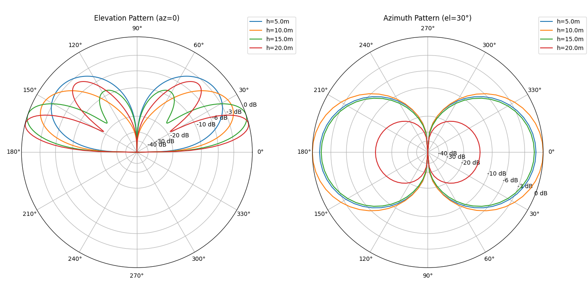
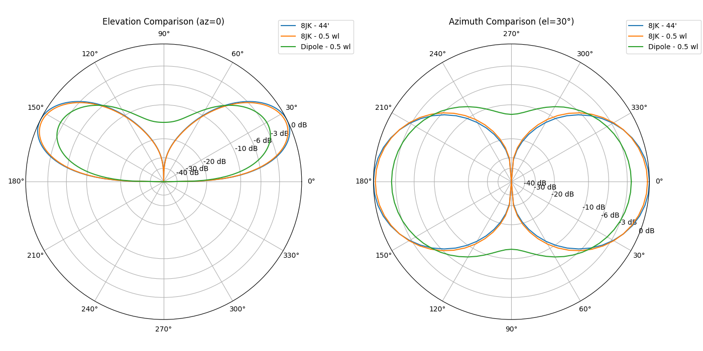

# Report for 8_jk

## Feedpoint Impedance vs Height (8JK - 44')

| Height (m) | R (Ω) | X (Ω) |
| --- | --- | --- |
| 5.0 | 85.15495 | 620.5207 |
| 10.0 | 127.8211 | 586.0678 |
| 15.0 | 107.7499 | 589.6409 |
| 20.0 | 118.159 | 591.3761 |

## Feedpoint Impedance vs Height (8JK - 0.5 wl)

| Height (m) | R (Ω) | X (Ω) |
| --- | --- | --- |
| 5.0 | 27.23075 | 9.393699 |
| 10.0 | 42.10815 | -0.699975 |
| 15.0 | 35.54451 | -0.272478 |
| 20.0 | 38.77084 | 0.618981 |

## Gain at az=0 for Elevation 0–180° (8JK - 44')

| Elevation (deg) | 5.0 m | 10.0 m | 15.0 m | 20.0 m |
| --- | --- | --- | --- | --- |
| 0 | -999.000 | -999.000 | -299.624 | -297.353 |
| 5 | -4.311 | -0.542 | 3.529 | 5.425 |
| 10 | 1.330 | 4.876 | 8.570 | 9.923 |
| 15 | 4.354 | 7.526 | 10.566 | **10.908** |
| 20 | 6.235 | 8.885 | **10.943** | 9.555 |
| 25 | 7.438 | **9.411** | 10.066 | 5.494 |
| 30 | 8.166 | 9.308 | 7.953 | -4.275 |
| 35 | 8.525 | 8.679 | 4.313 | -0.853 |
| 40 | **8.578** | 7.584 | -1.640 | 4.875 |
| 45 | 8.357 | 6.056 | -6.348 | 6.788 |
| 50 | 7.878 | 4.117 | -1.656 | 6.912 |
| 55 | 7.140 | 1.784 | 1.146 | 5.865 |
| 60 | 6.125 | -0.920 | 2.144 | 3.912 |
| 65 | 4.783 | -3.954 | 1.991 | 1.193 |
| 70 | 3.022 | -7.270 | 0.933 | -2.213 |
| 75 | 0.648 | -10.889 | -1.037 | -6.281 |
| 80 | -2.792 | -15.154 | -4.259 | -11.191 |
| 85 | -8.766 | -21.554 | -10.130 | -18.147 |
| 90 | -288.971 | -285.564 | -287.269 | -290.900 |
| 95 | -8.766 | -21.554 | -10.130 | -18.147 |
| 100 | -2.792 | -15.154 | -4.259 | -11.191 |
| 105 | 0.648 | -10.889 | -1.037 | -6.281 |
| 110 | 3.022 | -7.270 | 0.933 | -2.213 |
| 115 | 4.783 | -3.954 | 1.991 | 1.193 |
| 120 | 6.125 | -0.920 | 2.144 | 3.912 |
| 125 | 7.140 | 1.784 | 1.146 | 5.865 |
| 130 | 7.878 | 4.117 | -1.656 | 6.912 |
| 135 | 8.357 | 6.056 | -6.348 | 6.788 |
| 140 | **8.578** | 7.584 | -1.640 | 4.875 |
| 145 | 8.525 | 8.679 | 4.313 | -0.853 |
| 150 | 8.166 | 9.308 | 7.953 | -4.275 |
| 155 | 7.438 | **9.411** | 10.066 | 5.494 |
| 160 | 6.235 | 8.885 | **10.943** | 9.555 |
| 165 | 4.354 | 7.526 | 10.566 | **10.908** |
| 170 | 1.330 | 4.876 | 8.570 | 9.923 |
| 175 | -4.311 | -0.542 | 3.529 | 5.425 |
| 180 | -999.000 | -999.000 | -299.196 | -297.435 |

## Gain at az=0 for Elevation 0–180° (8JK - 0.5 wl)

| Elevation (deg) | 5.0 m | 10.0 m | 15.0 m | 20.0 m |
| --- | --- | --- | --- | --- |
| 0 | -999.000 | -999.000 | -297.779 | -298.370 |
| 5 | -4.512 | -0.780 | 3.275 | 5.190 |
| 10 | 1.129 | 4.638 | 8.317 | 9.688 |
| 15 | 4.152 | 7.289 | 10.313 | **10.672** |
| 20 | 6.034 | 8.647 | **10.689** | 9.320 |
| 25 | 7.237 | **9.173** | 9.812 | 5.258 |
| 30 | 7.964 | 9.070 | 7.700 | -4.511 |
| 35 | 8.324 | 8.441 | 4.059 | -1.089 |
| 40 | **8.376** | 7.346 | -1.893 | 4.639 |
| 45 | 8.156 | 5.818 | -6.602 | 6.552 |
| 50 | 7.677 | 3.879 | -1.909 | 6.677 |
| 55 | 6.939 | 1.546 | 0.893 | 5.630 |
| 60 | 5.923 | -1.157 | 1.890 | 3.677 |
| 65 | 4.582 | -4.191 | 1.738 | 0.958 |
| 70 | 2.821 | -7.508 | 0.680 | -2.448 |
| 75 | 0.447 | -11.127 | -1.291 | -6.516 |
| 80 | -2.993 | -15.392 | -4.513 | -11.426 |
| 85 | -8.967 | -21.792 | -10.383 | -18.382 |
| 90 | -263.257 | -281.832 | -296.425 | -280.338 |
| 95 | -8.967 | -21.792 | -10.383 | -18.382 |
| 100 | -2.993 | -15.392 | -4.513 | -11.426 |
| 105 | 0.447 | -11.127 | -1.291 | -6.516 |
| 110 | 2.821 | -7.508 | 0.680 | -2.448 |
| 115 | 4.582 | -4.191 | 1.738 | 0.958 |
| 120 | 5.923 | -1.157 | 1.890 | 3.677 |
| 125 | 6.939 | 1.546 | 0.893 | 5.630 |
| 130 | 7.677 | 3.879 | -1.909 | 6.677 |
| 135 | 8.156 | 5.818 | -6.602 | 6.552 |
| 140 | **8.376** | 7.346 | -1.893 | 4.639 |
| 145 | 8.324 | 8.441 | 4.059 | -1.089 |
| 150 | 7.964 | 9.070 | 7.700 | -4.511 |
| 155 | 7.237 | **9.173** | 9.812 | 5.258 |
| 160 | 6.034 | 8.647 | **10.689** | 9.320 |
| 165 | 4.152 | 7.289 | 10.313 | **10.672** |
| 170 | 1.129 | 4.638 | 8.317 | 9.688 |
| 175 | -4.512 | -0.780 | 3.275 | 5.190 |
| 180 | -999.000 | -999.000 | -299.888 | -298.370 |

## Azimuth and Elevation Patterns (8JK - 44')

## Azimuth and Elevation Patterns (8JK - 0.5 wl)

## 8JK vs Dipole Comparison (44' & 0.5 wl)

