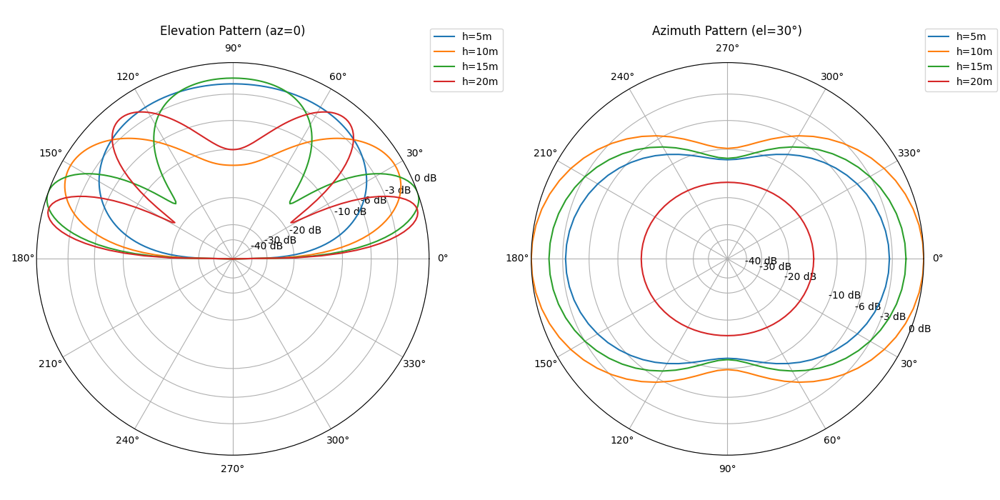

# Report for dipole_pattern

## Feedpoint Impedance vs Height

Parameters: frequency = 14.1 MHz; dipole_length = resonant_dipole_length(14.1 MHz); segments = 21; radius = 0.001 m; ground = average; heights = [5, 10, 15, 20] m

| Height (m) | R (Ω) | X (Ω) |
| --- | --- | --- |
| 5 | 76.65365 | -1.819609 |
| 10 | 68.74317 | -49.64125 |
| 15 | 63.42087 | -20.73104 |
| 20 | 72.25543 | -39.95716 |

## Gain at az=0 for Elevation 0–180°

Parameters: frequency = 14.1 MHz; dipole_length = resonant_dipole_length(14.1 MHz); segments = 21; radius = 0.001 m; ground = average; heights = [5, 10, 15, 20] m; azimuth = 0°

| Elevation (deg) | 5.0 m | 10.0 m | 15.0 m | 20.0 m |
| --- | --- | --- | --- | --- |
| 0 | -999.000 | -999.000 | -999.000 | -999.000 |
| 5 | -9.817 | -3.886 | -0.090 | 1.547 |
| 10 | -4.104 | 1.605 | 5.024 | 6.117 |
| 15 | -0.956 | 4.379 | 7.144 | **7.225** |
| 20 | 1.105 | 5.917 | **7.700** | 6.052 |
| 25 | 2.548 | 6.684 | 7.063 | 2.232 |
| 30 | 3.586 | **6.891** | 5.261 | -7.227 |
| 35 | 4.336 | 6.652 | 2.011 | -3.415 |
| 40 | 4.871 | 6.040 | -3.459 | 2.796 |
| 45 | 5.244 | 5.106 | -7.574 | 5.303 |
| 50 | 5.492 | 3.894 | -2.154 | 6.154 |
| 55 | 5.647 | 2.453 | 1.540 | 5.999 |
| 60 | 5.732 | 0.850 | 3.638 | 5.147 |
| 65 | 5.769 | -0.806 | 4.864 | 3.806 |
| 70 | **5.775** | -2.354 | 5.574 | 2.168 |
| 75 | 5.765 | -3.610 | 5.967 | 0.464 |
| 80 | 5.750 | -4.450 | 6.169 | -1.022 |
| 85 | 5.737 | -4.888 | 6.261 | -2.016 |
| 90 | 5.732 | -5.018 | 6.286 | -2.361 |
| 95 | 5.737 | -4.888 | 6.261 | -2.016 |
| 100 | 5.750 | -4.450 | 6.169 | -1.022 |
| 105 | 5.765 | -3.610 | 5.967 | 0.464 |
| 110 | **5.775** | -2.354 | 5.574 | 2.168 |
| 115 | 5.769 | -0.806 | 4.864 | 3.806 |
| 120 | 5.732 | 0.850 | 3.638 | 5.147 |
| 125 | 5.647 | 2.453 | 1.540 | 5.999 |
| 130 | 5.492 | 3.894 | -2.154 | 6.154 |
| 135 | 5.244 | 5.106 | -7.574 | 5.303 |
| 140 | 4.871 | 6.040 | -3.459 | 2.796 |
| 145 | 4.336 | 6.652 | 2.011 | -3.415 |
| 150 | 3.586 | **6.891** | 5.261 | -7.227 |
| 155 | 2.548 | 6.684 | 7.063 | 2.232 |
| 160 | 1.105 | 5.917 | **7.700** | 6.052 |
| 165 | -0.956 | 4.379 | 7.144 | **7.225** |
| 170 | -4.104 | 1.605 | 5.024 | 6.117 |
| 175 | -9.817 | -3.886 | -0.090 | 1.547 |
| 180 | -999.000 | -999.000 | -999.000 | -999.000 |

## Azimuth Pattern (el=30°)

Parameters: frequency = 14.1 MHz; dipole_length = resonant_dipole_length(14.1 MHz); segments = 21; radius = 0.001 m; ground = average; heights = [5, 10, 15, 20] m; elevation = 30°

